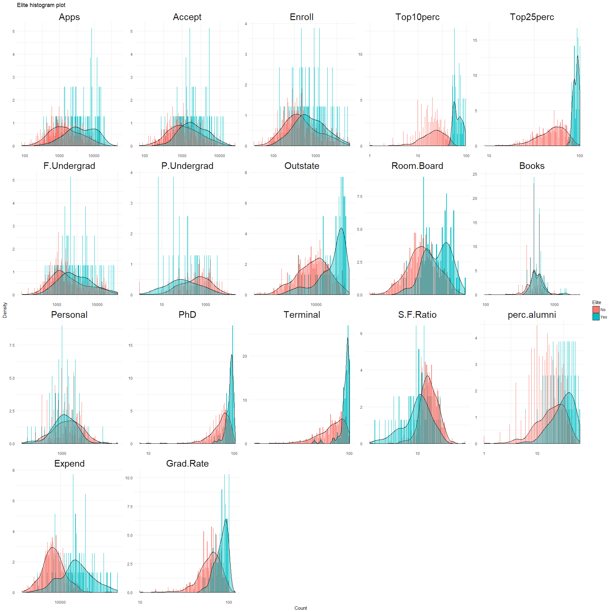
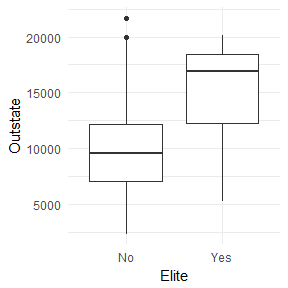
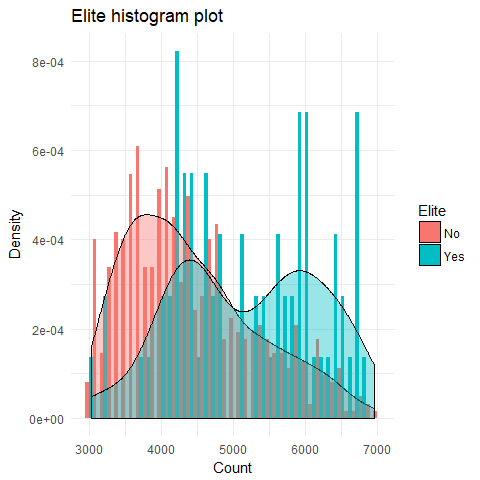
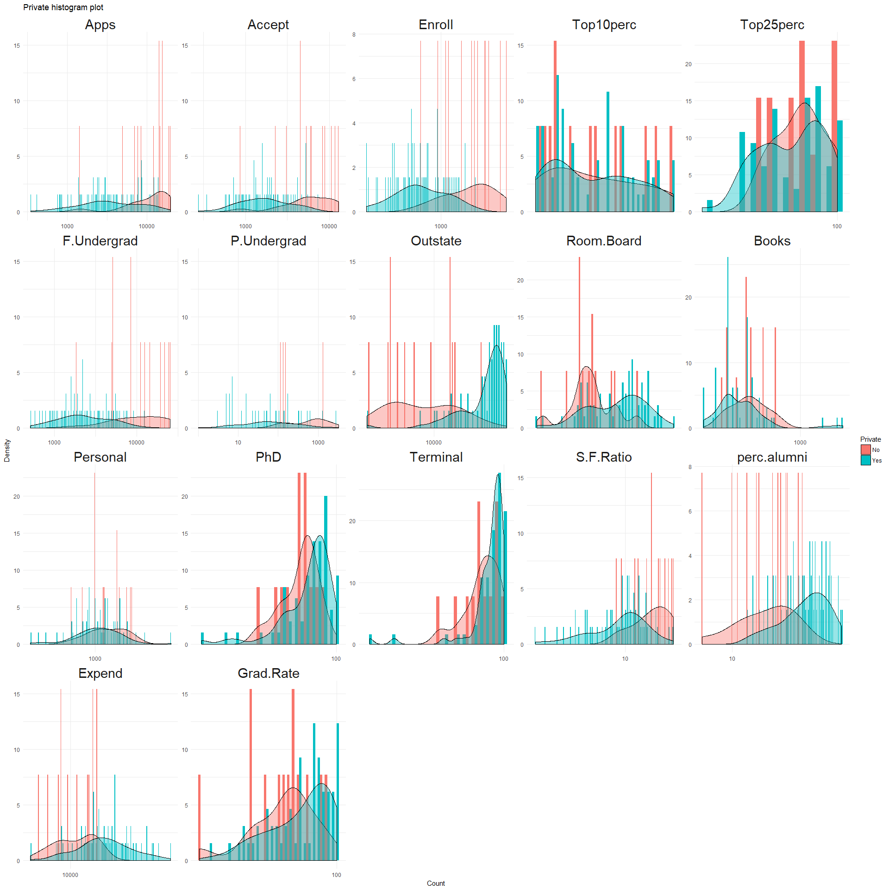

ISIL\_2\_8
================

ISIL\_2\_8
----------

This is a short excerpt of the tutorials from the ISIL book (Chapter 2, Question 8)

Required Libraries
------------------

Load the required librarys for the question

Data
----

Load the data from the csv file

``` r
college = read.csv("College.csv", header = TRUE, sep = ",")
```

Clean the data of the university name column, and add them as row ids

Create a new feature called Elite, based on if there are more than 50 students from the top 10% of high school graduates

Below is a summary of the college data:

``` r
summary(college)
```

    ##  Private        Apps           Accept          Enroll       Top10perc    
    ##  No :212   Min.   :   81   Min.   :   72   Min.   :  35   Min.   : 1.00  
    ##  Yes:565   1st Qu.:  776   1st Qu.:  604   1st Qu.: 242   1st Qu.:15.00  
    ##            Median : 1558   Median : 1110   Median : 434   Median :23.00  
    ##            Mean   : 3002   Mean   : 2019   Mean   : 780   Mean   :27.56  
    ##            3rd Qu.: 3624   3rd Qu.: 2424   3rd Qu.: 902   3rd Qu.:35.00  
    ##            Max.   :48094   Max.   :26330   Max.   :6392   Max.   :96.00  
    ##    Top25perc      F.Undergrad     P.Undergrad         Outstate    
    ##  Min.   :  9.0   Min.   :  139   Min.   :    1.0   Min.   : 2340  
    ##  1st Qu.: 41.0   1st Qu.:  992   1st Qu.:   95.0   1st Qu.: 7320  
    ##  Median : 54.0   Median : 1707   Median :  353.0   Median : 9990  
    ##  Mean   : 55.8   Mean   : 3700   Mean   :  855.3   Mean   :10441  
    ##  3rd Qu.: 69.0   3rd Qu.: 4005   3rd Qu.:  967.0   3rd Qu.:12925  
    ##  Max.   :100.0   Max.   :31643   Max.   :21836.0   Max.   :21700  
    ##    Room.Board       Books           Personal         PhD        
    ##  Min.   :1780   Min.   :  96.0   Min.   : 250   Min.   :  8.00  
    ##  1st Qu.:3597   1st Qu.: 470.0   1st Qu.: 850   1st Qu.: 62.00  
    ##  Median :4200   Median : 500.0   Median :1200   Median : 75.00  
    ##  Mean   :4358   Mean   : 549.4   Mean   :1341   Mean   : 72.66  
    ##  3rd Qu.:5050   3rd Qu.: 600.0   3rd Qu.:1700   3rd Qu.: 85.00  
    ##  Max.   :8124   Max.   :2340.0   Max.   :6800   Max.   :103.00  
    ##     Terminal       S.F.Ratio      perc.alumni        Expend     
    ##  Min.   : 24.0   Min.   : 2.50   Min.   : 0.00   Min.   : 3186  
    ##  1st Qu.: 71.0   1st Qu.:11.50   1st Qu.:13.00   1st Qu.: 6751  
    ##  Median : 82.0   Median :13.60   Median :21.00   Median : 8377  
    ##  Mean   : 79.7   Mean   :14.09   Mean   :22.74   Mean   : 9660  
    ##  3rd Qu.: 92.0   3rd Qu.:16.50   3rd Qu.:31.00   3rd Qu.:10830  
    ##  Max.   :100.0   Max.   :39.80   Max.   :64.00   Max.   :56233  
    ##    Grad.Rate      Elite    
    ##  Min.   : 10.00   No :699  
    ##  1st Qu.: 53.00   Yes: 78  
    ##  Median : 65.00            
    ##  Mean   : 65.46            
    ##  3rd Qu.: 78.00            
    ##  Max.   :118.00

Visualisations
--------------

Elite vs Non-Elite
------------------

We want to find out if there are any distribution differences between elite and non-elite universities:



Inferential Analysis - Elite vs. Non-Elite
------------------------------------------

    ##             estimate.mean in group No estimate.mean in group Yes
    ## Apps                       2669.22604                 5980.56410
    ## Accept                     1925.76252                 2852.60256
    ## Enroll                      748.64521                 1060.71795
    ## Top10perc                    23.08870                   67.61538
    ## Top25perc                    51.85694                   91.10256
    ## F.Undergrad                3601.39342                 4582.74359
    ## P.Undergrad                 914.48069                  324.93590
    ## Outstate                   9904.16595                15248.56410
    ## Room.Board                 4248.25179                 5336.79487
    ## Books                       544.30043                  594.91026
    ## Personal                   1357.65522                 1188.17949
    ## PhD                          70.80114                   89.32051
    ## Terminal                     78.09728                   94.08974
    ## S.F.Ratio                    14.47754                   10.61410
    ## perc.alumni                  21.49213                   33.96154
    ## Expend                     8684.36767                18404.87179
    ## Grad.Rate                    63.46352                   83.38462
    ##                   p.value statistic.t     conf.int1    conf.int2
    ## Apps         1.945690e-07   -5.661682  -4474.037297 -2148.638833
    ## Accept       3.581308e-03   -2.989539  -1542.558899  -311.121194
    ## Enroll       1.332788e-02   -2.524559   -557.639157   -66.506326
    ## Top10perc    5.834026e-46  -27.984956    -47.688036   -41.365337
    ## Top25perc   1.333264e-113  -42.150339    -41.079675   -37.411577
    ## F.Undergrad  1.176088e-01   -1.579704  -2215.163886   252.463545
    ## P.Undergrad  4.060305e-10    6.534780    411.787621   767.301958
    ## Outstate     2.144134e-18  -10.999455  -6309.541772 -4379.254531
    ## Room.Board   1.029431e-12   -8.251759  -1350.515525  -826.570642
    ## Books        2.218171e-02   -2.327133    -93.810194    -7.409461
    ## Personal     1.296152e-02    2.527388     36.537100   302.414369
    ## PhD          1.519787e-37  -17.029315    -20.667333   -16.371404
    ## Terminal     4.708424e-37  -16.624942    -17.891830   -14.093093
    ## S.F.Ratio    5.384281e-13    8.366747      2.946605     4.780269
    ## perc.alumni  3.430525e-11   -7.560665    -15.746429    -9.192385
    ## Expend       2.015552e-13   -8.839003 -11909.478543 -7531.529710
    ## Grad.Rate    6.163694e-24  -12.986371    -22.961143   -16.881049

-   The Elite universities receive, enrol, and accept more applications than the other universities
-   They have more full-time, but fewer part-time undergraduates than the other universities
-   They receive more out of state tuition than the other universities. It has a negatively skewed distribution. Why is this so? (futher analysis below)

-   As shown in the below boxplot, the Elite universities have a slightly larger IQR, and a lower mean than median value, which is reflected in its negative skew. The Non-elite university has a slightly more normal distribution:



| Stat   | Elite    | Non-Elite |
|--------|----------|-----------|
| Mean   | 15248.56 | 9904.166  |
| Median | 16950    | 9556      |
| 25th   | 12219    | 7070      |
| 75th   | 18411.5  | 12155     |

-   The room board is more expensive than the other universities, with a bimodal distribution (a dip in price in the middle of the distribution). What is causing this? Is it due to varying real estate prices based on state? (futher analysis below)


+ The dip occurs between 4500 - 5500. As shown below, the dip coincides with a lower Expenditure.


    ##             estimate.mean in group No estimate.mean in group Yes
    ## Apps                       5946.08065                 6114.18750
    ## Accept                     2620.32258                 3752.68750
    ## Enroll                     1001.62903                 1289.68750
    ## Top10perc                    68.51613                   64.12500
    ## Top25perc                    90.95161                   91.68750
    ## F.Undergrad                4276.51613                 5769.37500
    ## P.Undergrad                 312.93548                  371.43750
    ## Outstate                  15754.01613                13289.93750
    ## Room.Board                 5441.08065                 4932.68750
    ## Books                       602.64516                  564.93750
    ## Personal                   1198.82258                 1146.93750
    ## PhD                          89.64516                   88.06250
    ## Terminal                     93.82258                   95.12500
    ## S.F.Ratio                    10.37742                   11.53125
    ## perc.alumni                  34.67742                   31.18750
    ## Expend                    19369.74194                14666.00000
    ## Grad.Rate                    84.27419                   79.93750
    ##                 p.value statistic.t    conf.int1   conf.int2
    ## Apps        0.919378801  -0.1025031 -3589.261570 3253.047860
    ## Accept      0.310869647  -1.0449347 -3420.947823 1156.217984
    ## Enroll      0.514686825  -0.6655430 -1201.649296  625.532361
    ## Top10perc   0.173734837   1.3920896    -2.040401   10.822659
    ## Top25perc   0.642265613  -0.4699321    -3.952491    2.480717
    ## F.Undergrad 0.467694903  -0.7422827 -5724.659498 2738.941756
    ## P.Undergrad 0.667996698  -0.4327113  -333.406614  216.402582
    ## Outstate    0.041066320   2.1640370   108.885406 4819.271852
    ## Room.Board  0.004541251   2.9248658   162.200905  854.585386
    ## Books       0.321811934   1.0023949   -38.175597  113.590920
    ## Personal    0.710501221   0.3750861  -231.824794  335.594955
    ## PhD         0.455814187   0.7571539    -2.715487    5.880809
    ## Terminal    0.330601628  -0.9821090    -3.963636    1.358797
    ## S.F.Ratio   0.298980780  -1.0622425    -3.398895    1.091234
    ## perc.alumni 0.447341001   0.7749446    -5.897566   12.877404
    ## Expend      0.008203001   2.7357116  1263.473474 8144.010397
    ## Grad.Rate   0.198161951   1.3218087    -2.419294   11.092681

-   The personal spending are approximately similar around the mean, but there are fewer Elite university students that tend to spend less after the mean. (further analysis below)
-   There are higher number of PhDs, and Teriminal degrees at Elite universities
-   There is a lower Student to faculty ratio at Elite universitites. Is it because there are more faculties at Elite universities or more students at Non-elite universities?
-   The Instructional Expenditure per Student, Percentage of Alumni who Donate, and Graduation Rates are higher at Elite universities.

Private vs Non-Private
----------------------

As well as Private vs. Non-Private:



Inferential Analysis - Private vs. Non-Private
----------------------------------------------

    ##             estimate.mean in group No estimate.mean in group Yes
    ## Apps                       5729.91981                 1977.92920
    ## Accept                     3919.28774                 1305.70265
    ## Enroll                     1640.87264                  456.94513
    ## Top10perc                    22.83491                   29.33097
    ## Top25perc                    52.70283                   56.95752
    ## F.Undergrad                8571.00472                 1872.16814
    ## P.Undergrad                1978.18868                  433.96637
    ## Outstate                   6813.41038                11801.69381
    ## Room.Board                 3748.24057                 4586.14336
    ## Books                       554.37736                  547.50619
    ## Personal                   1676.98113                 1214.44071
    ## PhD                          76.83491                   71.09381
    ## Terminal                     82.81604                   78.53451
    ## S.F.Ratio                    17.13915                   12.94549
    ## perc.alumni                  14.35849                   25.89027
    ## Expend                     7458.31604                10486.35398
    ## Grad.Rate                    56.04245                   68.99823
    ##                  p.value statistic.t    conf.int1    conf.int2
    ## Apps        2.466367e-19   9.7985062  2997.758390  4506.222825
    ## Accept      7.591107e-22  10.6385279  2129.595210  3097.574952
    ## Enroll      1.648621e-30  13.3387131  1009.051802  1358.803215
    ## Top10perc   1.805543e-06  -4.8432838    -9.132558    -3.859578
    ## Top25perc   8.461183e-03  -2.6472480    -7.415090    -1.094294
    ## F.Undergrad 3.780118e-35  14.7879983  5806.253074  7591.420076
    ## P.Undergrad 2.819286e-18   9.5157703  1224.450123  1863.994492
    ## Outstate    2.485388e-87 -23.2488933 -5409.603242 -4566.963614
    ## Room.Board  4.230637e-26 -11.2217531  -984.620275  -691.185319
    ## Books       5.631735e-01   0.5785318   -16.465315    30.207642
    ## Personal    2.079635e-16   8.6277162   357.107826   567.973022
    ## PhD         3.903710e-07   5.1380703     3.546110     7.936091
    ## Terminal    5.620371e-05   4.0644819     2.211702     6.351347
    ## S.F.Ratio   6.404159e-41  15.1108667     3.648025     4.739303
    ## perc.alumni 4.631004e-47 -15.7095480   -12.973324   -10.090226
    ## Expend      3.228014e-22 -10.0143949 -3621.645705 -2434.430184
    ## Grad.Rate   2.052243e-23 -10.5793109   -15.362758   -10.548796
