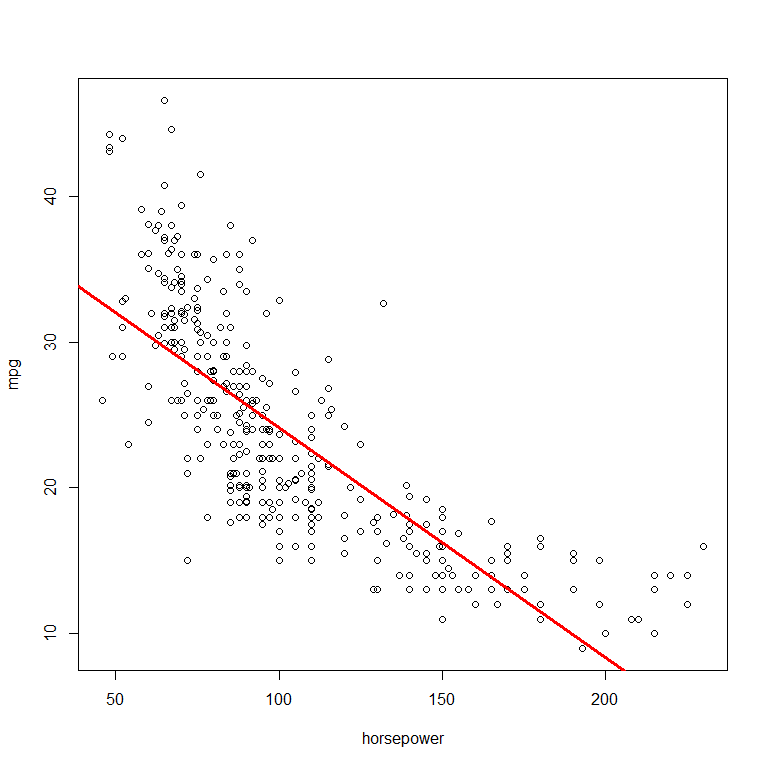
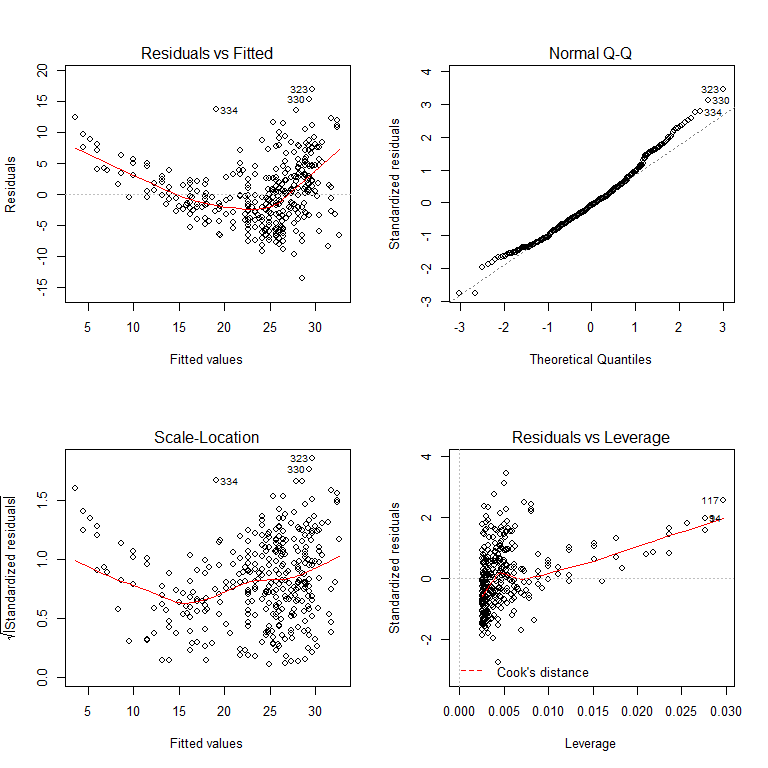
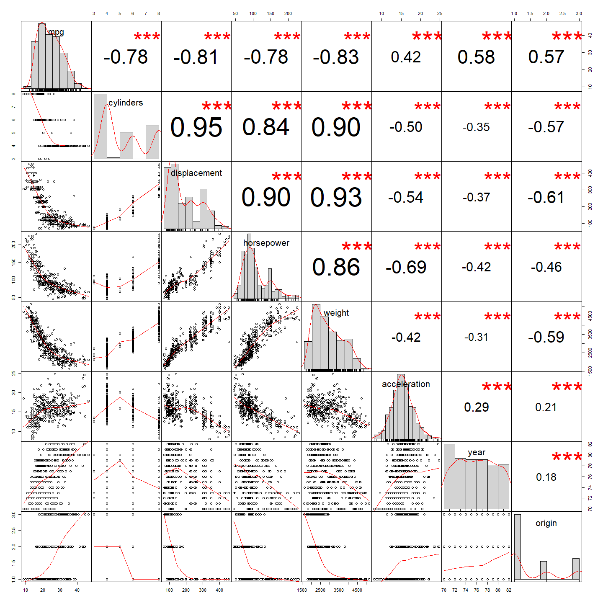
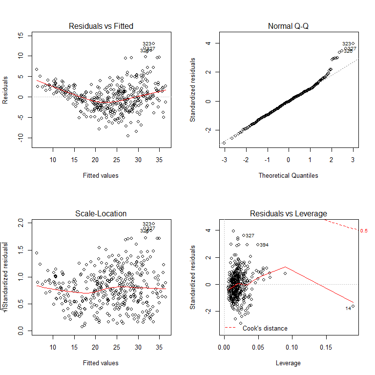
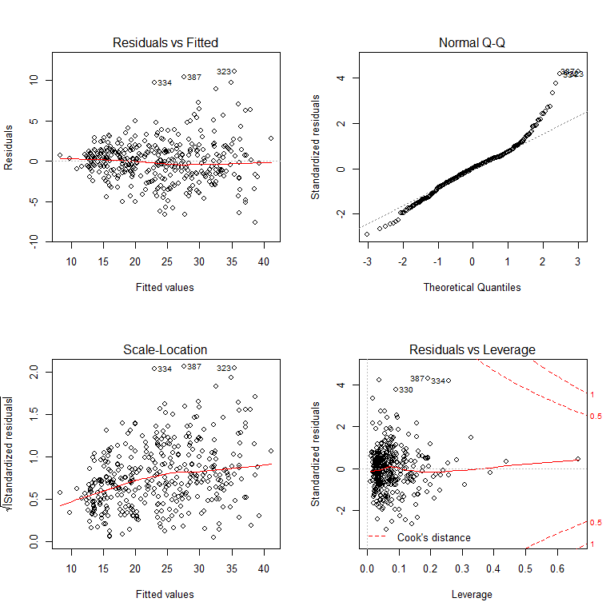
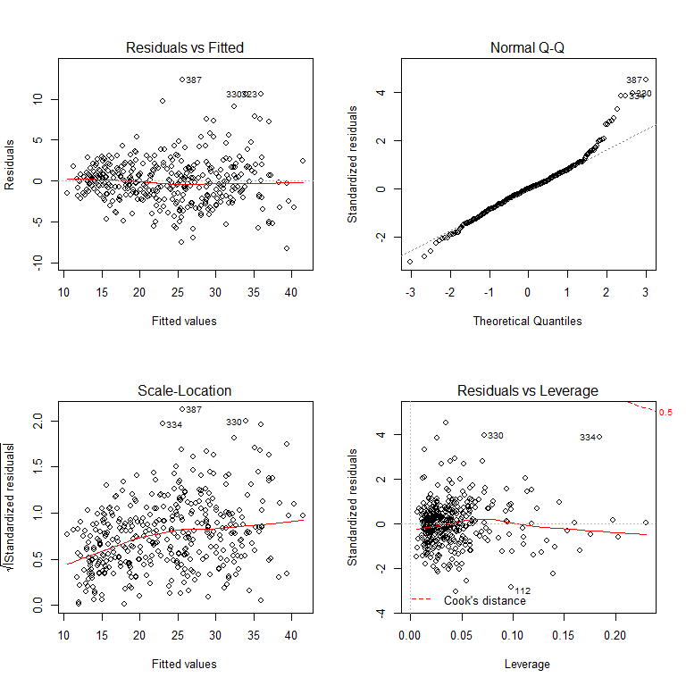
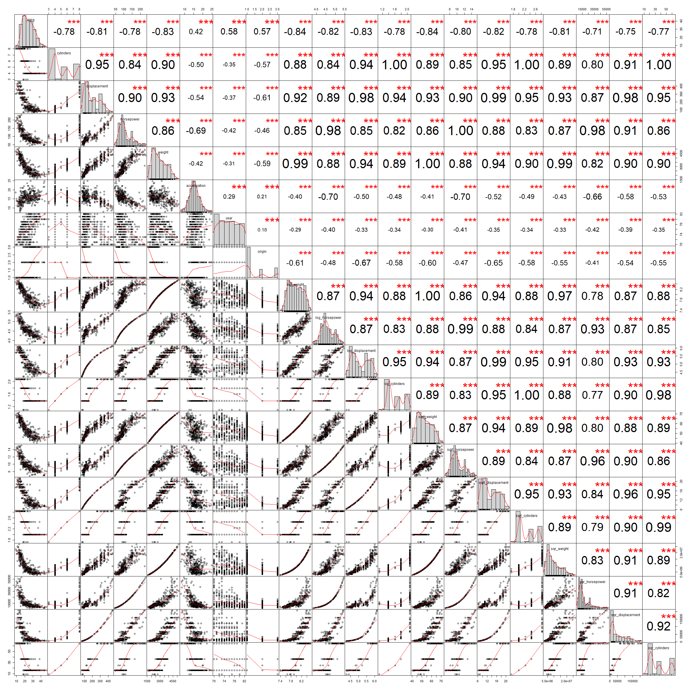

ISIL\_3\_6
================

ISIL\_3\_7
----------

This is a short excerpt of the tutorials from the ISIL book (Chapter 3.7)

8. This question involves the use of simple linear regression on the Auto data set.
-----------------------------------------------------------------------------------

Load the required librarys for the question

Data
----

Load the data from the library, and print the column names

``` r
attach(Auto)
names(Auto)
```

    ## [1] "mpg"          "cylinders"    "displacement" "horsepower"  
    ## [5] "weight"       "acceleration" "year"         "origin"      
    ## [9] "name"

8 a) Simple Linear Regression mpg vs horsepower
-----------------------------------------------

Do a linear regression of the mpg vs horsepower

``` r
lm.fit = lm(mpg~horsepower, data=Auto)
lm.fit
```

    ## 
    ## Call:
    ## lm(formula = mpg ~ horsepower, data = Auto)
    ## 
    ## Coefficients:
    ## (Intercept)   horsepower  
    ##     39.9359      -0.1578

``` r
summary(lm.fit)
```

    ## 
    ## Call:
    ## lm(formula = mpg ~ horsepower, data = Auto)
    ## 
    ## Residuals:
    ##      Min       1Q   Median       3Q      Max 
    ## -13.5710  -3.2592  -0.3435   2.7630  16.9240 
    ## 
    ## Coefficients:
    ##              Estimate Std. Error t value Pr(>|t|)    
    ## (Intercept) 39.935861   0.717499   55.66   <2e-16 ***
    ## horsepower  -0.157845   0.006446  -24.49   <2e-16 ***
    ## ---
    ## Signif. codes:  0 '***' 0.001 '**' 0.01 '*' 0.05 '.' 0.1 ' ' 1
    ## 
    ## Residual standard error: 4.906 on 390 degrees of freedom
    ## Multiple R-squared:  0.6059, Adjusted R-squared:  0.6049 
    ## F-statistic: 599.7 on 1 and 390 DF,  p-value: < 2.2e-16

``` r
mean(mpg)
```

    ## [1] 23.44592

Is there a relationship between the predictor and the response? i) There is a relationship between the predictor and the response. ii) The relationship is strong, where the Null Hypothesis for β is rejected, based on the p-values, T-Stat and F-Stat values. The mean value is 23.44592, and the is a percentage error of 21%. The R-square value of 0.6059 indicates that the preidctor contributes to approximately 60% of the variability. iii) It is a negative relationship. iv) As shown below, the predicted value for horsepower = 98 is 24.46708 with a C.I of 23.97308 - 24.96108 and P.I of 14.8094 - 34.12476

``` r
predict(lm.fit, data.frame(horsepower = 98), interval = "confidence")
```

    ##        fit      lwr      upr
    ## 1 24.46708 23.97308 24.96108

``` r
predict(lm.fit, data.frame(horsepower = 98), interval = "prediction")
```

    ##        fit     lwr      upr
    ## 1 24.46708 14.8094 34.12476

8 b) Plot the response and the predictor. Use the abline() function to display the least squares regression line.

``` r
plot(horsepower, mpg)
abline(lm.fit, lwd=3, col="red")
```



8 c) Use the plot() function to produce diagnostic plots of the least squares regression fit. Comment on any problems you see with the fit. The Residual vs. Fitted plot shows non-linearity between the predictor and response. The Residual vs. Leverage plot shows outliers.

``` r
par(mfrow=c(2,2))
plot(lm.fit)
```



9 This question involves the use of multiple linear regression on the Auto data set.
------------------------------------------------------------------------------------

9 a) Produce a scatterplot matrix which includes all the variables in the data set. 9 b) Produce a correlation matrix of all the variables in the data set.

``` r
chart.Correlation(Auto[, -grep("name", colnames(Auto))])
```



9 c) Create a Multi Regression Model, including all the variables in the data set.

``` r
lm.fit = lm(mpg~.-name, data=Auto)
lm.fit
```

    ## 
    ## Call:
    ## lm(formula = mpg ~ . - name, data = Auto)
    ## 
    ## Coefficients:
    ##  (Intercept)     cylinders  displacement    horsepower        weight  
    ##   -17.218435     -0.493376      0.019896     -0.016951     -0.006474  
    ## acceleration          year        origin  
    ##     0.080576      0.750773      1.426140

``` r
summary(lm.fit)
```

    ## 
    ## Call:
    ## lm(formula = mpg ~ . - name, data = Auto)
    ## 
    ## Residuals:
    ##     Min      1Q  Median      3Q     Max 
    ## -9.5903 -2.1565 -0.1169  1.8690 13.0604 
    ## 
    ## Coefficients:
    ##                Estimate Std. Error t value Pr(>|t|)    
    ## (Intercept)  -17.218435   4.644294  -3.707  0.00024 ***
    ## cylinders     -0.493376   0.323282  -1.526  0.12780    
    ## displacement   0.019896   0.007515   2.647  0.00844 ** 
    ## horsepower    -0.016951   0.013787  -1.230  0.21963    
    ## weight        -0.006474   0.000652  -9.929  < 2e-16 ***
    ## acceleration   0.080576   0.098845   0.815  0.41548    
    ## year           0.750773   0.050973  14.729  < 2e-16 ***
    ## origin         1.426141   0.278136   5.127 4.67e-07 ***
    ## ---
    ## Signif. codes:  0 '***' 0.001 '**' 0.01 '*' 0.05 '.' 0.1 ' ' 1
    ## 
    ## Residual standard error: 3.328 on 384 degrees of freedom
    ## Multiple R-squared:  0.8215, Adjusted R-squared:  0.8182 
    ## F-statistic: 252.4 on 7 and 384 DF,  p-value: < 2.2e-16

1.  There is a relationship between the predictors and the response based on the p-values, and F-Stat values. The mean value is 23.44592, and the is a percentage error of 14% (RSE of 3.328). The R-square value of 0.8215 indicates that the predictor contributes to approximately 82% of the variability.
2.  The displacement, weight, year, and origin predictors have a statistically significant relationship with the response.
3.  The coeffecient of year suggests an average effect of a 0.75 increase for every year increase (with all other predictor held constant). In other words, newer cars have higher MPG than older cars.

9 d) Residual plot The Residual vs. Fitted plot shows non-linearity between the predictor and response. The Residual vs. Leverage plot shows outliers (327 and 394) and leverage points (14).

``` r
par(mfrow=c(2,2))
plot(lm.fit)
```

 9 e) Use the \* and : symbols to fit linear regression models

``` r
lm.fit = lm(mpg~.^2, data=Auto[, -grep("name", colnames(Auto))])
summary(lm.fit)
```

    ## 
    ## Call:
    ## lm(formula = mpg ~ .^2, data = Auto[, -grep("name", colnames(Auto))])
    ## 
    ## Residuals:
    ##     Min      1Q  Median      3Q     Max 
    ## -7.6303 -1.4481  0.0596  1.2739 11.1386 
    ## 
    ## Coefficients:
    ##                             Estimate Std. Error t value Pr(>|t|)   
    ## (Intercept)                3.548e+01  5.314e+01   0.668  0.50475   
    ## cylinders                  6.989e+00  8.248e+00   0.847  0.39738   
    ## displacement              -4.785e-01  1.894e-01  -2.527  0.01192 * 
    ## horsepower                 5.034e-01  3.470e-01   1.451  0.14769   
    ## weight                     4.133e-03  1.759e-02   0.235  0.81442   
    ## acceleration              -5.859e+00  2.174e+00  -2.696  0.00735 **
    ## year                       6.974e-01  6.097e-01   1.144  0.25340   
    ## origin                    -2.090e+01  7.097e+00  -2.944  0.00345 **
    ## cylinders:displacement    -3.383e-03  6.455e-03  -0.524  0.60051   
    ## cylinders:horsepower       1.161e-02  2.420e-02   0.480  0.63157   
    ## cylinders:weight           3.575e-04  8.955e-04   0.399  0.69000   
    ## cylinders:acceleration     2.779e-01  1.664e-01   1.670  0.09584 . 
    ## cylinders:year            -1.741e-01  9.714e-02  -1.793  0.07389 . 
    ## cylinders:origin           4.022e-01  4.926e-01   0.816  0.41482   
    ## displacement:horsepower   -8.491e-05  2.885e-04  -0.294  0.76867   
    ## displacement:weight        2.472e-05  1.470e-05   1.682  0.09342 . 
    ## displacement:acceleration -3.479e-03  3.342e-03  -1.041  0.29853   
    ## displacement:year          5.934e-03  2.391e-03   2.482  0.01352 * 
    ## displacement:origin        2.398e-02  1.947e-02   1.232  0.21875   
    ## horsepower:weight         -1.968e-05  2.924e-05  -0.673  0.50124   
    ## horsepower:acceleration   -7.213e-03  3.719e-03  -1.939  0.05325 . 
    ## horsepower:year           -5.838e-03  3.938e-03  -1.482  0.13916   
    ## horsepower:origin          2.233e-03  2.930e-02   0.076  0.93931   
    ## weight:acceleration        2.346e-04  2.289e-04   1.025  0.30596   
    ## weight:year               -2.245e-04  2.127e-04  -1.056  0.29182   
    ## weight:origin             -5.789e-04  1.591e-03  -0.364  0.71623   
    ## acceleration:year          5.562e-02  2.558e-02   2.174  0.03033 * 
    ## acceleration:origin        4.583e-01  1.567e-01   2.926  0.00365 **
    ## year:origin                1.393e-01  7.399e-02   1.882  0.06062 . 
    ## ---
    ## Signif. codes:  0 '***' 0.001 '**' 0.01 '*' 0.05 '.' 0.1 ' ' 1
    ## 
    ## Residual standard error: 2.695 on 363 degrees of freedom
    ## Multiple R-squared:  0.8893, Adjusted R-squared:  0.8808 
    ## F-statistic: 104.2 on 28 and 363 DF,  p-value: < 2.2e-16

It appears that acceleration and origin are statistically significant. Overall, the model fits better with the interaction effects. The RSE has reduced to 2.695. The R-square is 0.8893, which indicates that the model covers approximately 88% of the effect of mpg.

``` r
par(mfrow=c(2,2))
plot(lm.fit)
```

 The Residual vs Fitted plot looks fairly linear, and so does the Residual vs. Leverage plot. There are 3 outliers (323, 387 and 334)

Removing the highly correlated predictors (displacement and weight), as well as the outliers:

``` r
lm.fit = lm(mpg~.^2, data=Auto[-c(323, 387, 334), -grep(c("name|displacement|horsepower"), colnames(Auto))])
summary(lm.fit)
```

    ## 
    ## Call:
    ## lm(formula = mpg ~ .^2, data = Auto[-c(323, 387, 334), -grep(c("name|displacement|horsepower"), 
    ##     colnames(Auto))])
    ## 
    ## Residuals:
    ##     Min      1Q  Median      3Q     Max 
    ## -8.3318 -1.6732  0.0005  1.4229 12.3803 
    ## 
    ## Coefficients:
    ##                          Estimate Std. Error t value Pr(>|t|)    
    ## (Intercept)             1.231e+02  3.933e+01   3.131 0.001880 ** 
    ## cylinders              -9.674e+00  4.543e+00  -2.130 0.033852 *  
    ## weight                 -3.292e-03  1.027e-02  -0.321 0.748757    
    ## acceleration           -7.455e+00  1.469e+00  -5.074 6.17e-07 ***
    ## year                   -4.176e-01  4.694e-01  -0.890 0.374236    
    ## origin                 -2.043e+01  5.706e+00  -3.581 0.000388 ***
    ## cylinders:weight        1.386e-03  2.315e-04   5.986 5.06e-09 ***
    ## cylinders:acceleration  1.322e-01  7.336e-02   1.803 0.072250 .  
    ## cylinders:year          2.484e-02  6.323e-02   0.393 0.694600    
    ## cylinders:origin        1.005e+00  3.316e-01   3.031 0.002605 ** 
    ## weight:acceleration    -1.253e-05  1.446e-04  -0.087 0.930983    
    ## weight:year            -1.431e-04  1.310e-04  -1.092 0.275439    
    ## weight:origin          -4.491e-05  6.717e-04  -0.067 0.946734    
    ## acceleration:year       8.142e-02  1.742e-02   4.675 4.12e-06 ***
    ## acceleration:origin     5.145e-01  1.112e-01   4.626 5.14e-06 ***
    ## year:origin             1.089e-01  6.374e-02   1.709 0.088260 .  
    ## ---
    ## Signif. codes:  0 '***' 0.001 '**' 0.01 '*' 0.05 '.' 0.1 ' ' 1
    ## 
    ## Residual standard error: 2.787 on 373 degrees of freedom
    ## Multiple R-squared:  0.8763, Adjusted R-squared:  0.8714 
    ## F-statistic: 176.2 on 15 and 373 DF,  p-value: < 2.2e-16

There is a slight decrease of the model's R-squared to 0.8763. The RSE increases to 2.787.

``` r
par(mfrow=c(2,2))
plot(lm.fit)
```

 The Residual vs Fitted plot looks fairly linear, and so does the Residual vs. Leverage plot.

1.  Trying a few transformations of variables

``` r
Auto$log_weight = log(Auto$weight)
Auto$log_horsepower = log(Auto$horsepower)
Auto$log_displacement = log(Auto$displacement)
Auto$log_cylinders = log(Auto$cylinders)

Auto$sqrt_weight = sqrt(Auto$weight)
Auto$sqrt_horsepower = sqrt(Auto$horsepower)
Auto$sqrt_displacement = sqrt(Auto$displacement)
Auto$sqrt_cylinders = sqrt(Auto$cylinders)

Auto$sqr_weight = (Auto$weight)^2
Auto$sqr_horsepower = (Auto$horsepower)^2
Auto$sqr_displacement = (Auto$displacement)^2
Auto$sqr_cylinders = (Auto$cylinders)^2
chart.Correlation(Auto[, -grep("name", colnames(Auto))])
```


