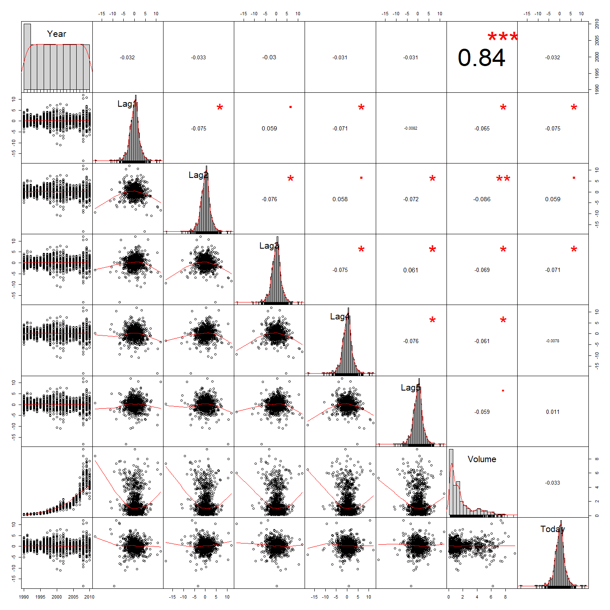

ISLR Chapter 4 Exercise
================

ISIL\_4\_7\_10
--------------

This is a short excerpt of the tutorials from the ISIL book (Chapter 4.7)

4.6.1 The Weekly Data
---------------------

Load the required librarys for the question

Attach the data

    ##   Year   Lag1   Lag2   Lag3   Lag4   Lag5    Volume  Today Direction
    ## 1 1990  0.816  1.572 -3.936 -0.229 -3.484 0.1549760 -0.270      Down
    ## 2 1990 -0.270  0.816  1.572 -3.936 -0.229 0.1485740 -2.576      Down
    ## 3 1990 -2.576 -0.270  0.816  1.572 -3.936 0.1598375  3.514        Up
    ## 4 1990  3.514 -2.576 -0.270  0.816  1.572 0.1616300  0.712        Up
    ## 5 1990  0.712  3.514 -2.576 -0.270  0.816 0.1537280  1.178        Up
    ## 6 1990  1.178  0.712  3.514 -2.576 -0.270 0.1544440 -1.372      Down

### 10 a) Produce some numerical and graphical summaries of the Weekly data. Do there appear to be any patterns?

Find out the correlations between the predictors

``` r
name_col = names(Weekly)[sapply(Weekly, is.numeric)]
name_col = paste(name_col, collapse="|")
num_col = grep(name_col, col_names)
summary(Weekly)
```

    ##       Year           Lag1               Lag2               Lag3         
    ##  Min.   :1990   Min.   :-18.1950   Min.   :-18.1950   Min.   :-18.1950  
    ##  1st Qu.:1995   1st Qu.: -1.1540   1st Qu.: -1.1540   1st Qu.: -1.1580  
    ##  Median :2000   Median :  0.2410   Median :  0.2410   Median :  0.2410  
    ##  Mean   :2000   Mean   :  0.1506   Mean   :  0.1511   Mean   :  0.1472  
    ##  3rd Qu.:2005   3rd Qu.:  1.4050   3rd Qu.:  1.4090   3rd Qu.:  1.4090  
    ##  Max.   :2010   Max.   : 12.0260   Max.   : 12.0260   Max.   : 12.0260  
    ##       Lag4               Lag5              Volume       
    ##  Min.   :-18.1950   Min.   :-18.1950   Min.   :0.08747  
    ##  1st Qu.: -1.1580   1st Qu.: -1.1660   1st Qu.:0.33202  
    ##  Median :  0.2380   Median :  0.2340   Median :1.00268  
    ##  Mean   :  0.1458   Mean   :  0.1399   Mean   :1.57462  
    ##  3rd Qu.:  1.4090   3rd Qu.:  1.4050   3rd Qu.:2.05373  
    ##  Max.   : 12.0260   Max.   : 12.0260   Max.   :9.32821  
    ##      Today          Direction 
    ##  Min.   :-18.1950   Down:484  
    ##  1st Qu.: -1.1540   Up  :605  
    ##  Median :  0.2410             
    ##  Mean   :  0.1499             
    ##  3rd Qu.:  1.4050             
    ##  Max.   : 12.0260

``` r
cor(Weekly[, num_col])
```

    ##               Year         Lag1        Lag2        Lag3         Lag4
    ## Year    1.00000000 -0.032289274 -0.03339001 -0.03000649 -0.031127923
    ## Lag1   -0.03228927  1.000000000 -0.07485305  0.05863568 -0.071273876
    ## Lag2   -0.03339001 -0.074853051  1.00000000 -0.07572091  0.058381535
    ## Lag3   -0.03000649  0.058635682 -0.07572091  1.00000000 -0.075395865
    ## Lag4   -0.03112792 -0.071273876  0.05838153 -0.07539587  1.000000000
    ## Lag5   -0.03051910 -0.008183096 -0.07249948  0.06065717 -0.075675027
    ## Volume  0.84194162 -0.064951313 -0.08551314 -0.06928771 -0.061074617
    ## Today  -0.03245989 -0.075031842  0.05916672 -0.07124364 -0.007825873
    ##                Lag5      Volume        Today
    ## Year   -0.030519101  0.84194162 -0.032459894
    ## Lag1   -0.008183096 -0.06495131 -0.075031842
    ## Lag2   -0.072499482 -0.08551314  0.059166717
    ## Lag3    0.060657175 -0.06928771 -0.071243639
    ## Lag4   -0.075675027 -0.06107462 -0.007825873
    ## Lag5    1.000000000 -0.05851741  0.011012698
    ## Volume -0.058517414  1.00000000 -0.033077783
    ## Today   0.011012698 -0.03307778  1.000000000



There is a correlation between Volume and Year (0.84). As the Year progresses, the Volume of Stock increases.

### 10 b) Use the full data set to perform a logistic regression with Direction as the response and the five lag variables plus Volume as predictors. Use the summary function to print the results. Do any of the predictors appear to be statistically significant? If so, which ones?

``` r
model.fit=glm(Direction~.-Year-Today, data = Weekly, family = binomial)
summary(model.fit)
```

    ## 
    ## Call:
    ## glm(formula = Direction ~ . - Year - Today, family = binomial, 
    ##     data = Weekly)
    ## 
    ## Deviance Residuals: 
    ##     Min       1Q   Median       3Q      Max  
    ## -1.6949  -1.2565   0.9913   1.0849   1.4579  
    ## 
    ## Coefficients:
    ##             Estimate Std. Error z value Pr(>|z|)   
    ## (Intercept)  0.26686    0.08593   3.106   0.0019 **
    ## Lag1        -0.04127    0.02641  -1.563   0.1181   
    ## Lag2         0.05844    0.02686   2.175   0.0296 * 
    ## Lag3        -0.01606    0.02666  -0.602   0.5469   
    ## Lag4        -0.02779    0.02646  -1.050   0.2937   
    ## Lag5        -0.01447    0.02638  -0.549   0.5833   
    ## Volume      -0.02274    0.03690  -0.616   0.5377   
    ## ---
    ## Signif. codes:  0 '***' 0.001 '**' 0.01 '*' 0.05 '.' 0.1 ' ' 1
    ## 
    ## (Dispersion parameter for binomial family taken to be 1)
    ## 
    ##     Null deviance: 1496.2  on 1088  degrees of freedom
    ## Residual deviance: 1486.4  on 1082  degrees of freedom
    ## AIC: 1500.4
    ## 
    ## Number of Fisher Scoring iterations: 4

Lag2 has a significant coefficient.

### 10 c) Compute the confusion matrix and overall fraction of correct predictions. Explain what the confusion matrix is telling you about the types of mistakes made by logistic regression.

``` r
model.prob = predict(model.fit, Weekly, type = "response")
model.pred = rep("Down", length(model.prob))
model.pred[model.prob > 0.5] = "Up"
confusion_matrix = table(model.pred, Direction)
confusion_matrix
```

    ##           Direction
    ## model.pred Down  Up
    ##       Down   54  48
    ##       Up    430 557

``` r
mean(model.pred == Weekly$Direction)
```

    ## [1] 0.5610652

The overall directional accuracy is 56.10%

``` r
model.specificity <- confusion_matrix["Down", "Up"]/(confusion_matrix["Down", "Up"] + confusion_matrix["Down", "Down"]) 
model.sensitivity <- confusion_matrix["Up", "Up"]/(confusion_matrix["Up", "Up"] + confusion_matrix["Up", "Down"]) 
model.precision <- confusion_matrix["Up", "Up"]/(confusion_matrix["Up", "Up"] + confusion_matrix["Down", "Up"]) 

data.frame("measurements"=c("specificity", "sensitivity", "model.precision"), "rate"=c(model.specificity, model.sensitivity, model.precision))
```

    ##      measurements      rate
    ## 1     specificity 0.4705882
    ## 2     sensitivity 0.5643364
    ## 3 model.precision 0.9206612

### 10 d) Now fit the logistic regression model using a training data period from 1990 to 2008, with Lag2 as the only predictor. Compute the confusion matrix and the overall fraction of correct predictions for the held out data (that is, the data from 2009 and 2010).

``` r
Year.train = (Year < 2009)
Weekly.train = Weekly[Year.train, ]
model.fit = glm(Direction~Lag2, data = Weekly.train, family = binomial)
model.prob = predict(model.fit, Weekly[!Year.train, ], type = "response")
model.pred = rep("Down", length(model.prob))
model.pred[model.prob > 0.5] = "Up"
confusion_matrix = table(model.pred, Direction[!Year.train])
confusion_matrix
```

    ##           
    ## model.pred Down Up
    ##       Down    9  5
    ##       Up     34 56

``` r
mean(model.pred == Weekly[!Year.train, ]$Direction)
```

    ## [1] 0.625

The overall directional accuracy is 62.5%

``` r
model.specificity <- confusion_matrix["Down", "Up"]/(confusion_matrix["Down", "Up"] + confusion_matrix["Down", "Down"]) 
model.sensitivity <- confusion_matrix["Up", "Up"]/(confusion_matrix["Up", "Up"] + confusion_matrix["Up", "Down"]) 
model.precision <- confusion_matrix["Up", "Up"]/(confusion_matrix["Up", "Up"] + confusion_matrix["Down", "Up"]) 

data.frame("measurements"=c("specificity", "sensitivity", "model.precision"), "rate"=c(model.specificity, model.sensitivity, model.precision))
```

    ##      measurements      rate
    ## 1     specificity 0.3571429
    ## 2     sensitivity 0.6222222
    ## 3 model.precision 0.9180328

### 10 e) LDA

``` r
Year.train = (Year < 2009)
Weekly.train = Weekly[Year.train, ]
model.fit = lda(Direction ~Lag2, data = Weekly.train, family = binomial)
model.prob = predict(model.fit, Weekly[!Year.train, ])
model.pred = model.prob$class
confusion_matrix = table(model.pred, Direction[!Year.train])
confusion_matrix
```

    ##           
    ## model.pred Down Up
    ##       Down    9  5
    ##       Up     34 56

``` r
mean(model.pred == Weekly[!Year.train, ]$Direction)
```

    ## [1] 0.625

The overall directional accuracy is 62.5%

``` r
model.specificity <- confusion_matrix["Down", "Up"]/(confusion_matrix["Down", "Up"] + confusion_matrix["Down", "Down"]) 
model.sensitivity <- confusion_matrix["Up", "Up"]/(confusion_matrix["Up", "Up"] + confusion_matrix["Up", "Down"]) 
model.precision <- confusion_matrix["Up", "Up"]/(confusion_matrix["Up", "Up"] + confusion_matrix["Down", "Up"]) 

data.frame("measurements"=c("specificity", "sensitivity", "model.precision"), "rate"=c(model.specificity, model.sensitivity, model.precision))
```

    ##      measurements      rate
    ## 1     specificity 0.3571429
    ## 2     sensitivity 0.6222222
    ## 3 model.precision 0.9180328

### 10 f) QDA

``` r
Year.train = (Year < 2009)
Weekly.train = Weekly[Year.train, ]
model.fit = qda(Direction ~Lag2, data = Weekly.train, family = binomial)
model.prob = predict(model.fit, Weekly[!Year.train, ])
model.pred = model.prob$class
confusion_matrix = table(model.pred, Direction[!Year.train])
confusion_matrix
```

    ##           
    ## model.pred Down Up
    ##       Down    0  0
    ##       Up     43 61

``` r
mean(model.pred == Weekly[!Year.train, ]$Direction)
```

    ## [1] 0.5865385

The overall directional accuracy is 58.6%

``` r
model.specificity <- confusion_matrix["Down", "Up"]/(confusion_matrix["Down", "Up"] + confusion_matrix["Down", "Down"]) 
model.sensitivity <- confusion_matrix["Up", "Up"]/(confusion_matrix["Up", "Up"] + confusion_matrix["Up", "Down"]) 
model.precision <- confusion_matrix["Up", "Up"]/(confusion_matrix["Up", "Up"] + confusion_matrix["Down", "Up"]) 

data.frame("measurements"=c("specificity", "sensitivity", "model.precision"), "rate"=c(model.specificity, model.sensitivity, model.precision))
```

    ##      measurements      rate
    ## 1     specificity       NaN
    ## 2     sensitivity 0.5865385
    ## 3 model.precision 1.0000000

### 10 g) KNN

``` r
library(class)
train.X <- as.matrix(Lag2[Year.train])
test.X <- as.matrix(Lag2[!Year.train])
train.Direction <- Direction[Year.train]
set.seed(1)
pred.knn <- knn(train.X, test.X, train.Direction, k = 1)
confusion_matrix = table(pred.knn, Weekly[!Year.train, ]$Direction)
confusion_matrix
```

    ##         
    ## pred.knn Down Up
    ##     Down   21 30
    ##     Up     22 31

``` r
mean(pred.knn == Weekly[!Year.train, ]$Direction)
```

    ## [1] 0.5

The overall directional accuracy is 58.5%

``` r
model.specificity <- confusion_matrix["Down", "Up"]/(confusion_matrix["Down", "Up"] + confusion_matrix["Down", "Down"]) 
model.sensitivity <- confusion_matrix["Up", "Up"]/(confusion_matrix["Up", "Up"] + confusion_matrix["Up", "Down"]) 
model.precision <- confusion_matrix["Up", "Up"]/(confusion_matrix["Up", "Up"] + confusion_matrix["Down", "Up"]) 

data.frame("measurements"=c("specificity", "sensitivity", "model.precision"), "rate"=c(model.specificity, model.sensitivity, model.precision))
```

    ##      measurements      rate
    ## 1     specificity 0.5882353
    ## 2     sensitivity 0.5849057
    ## 3 model.precision 0.5081967

The models from d) and e) perform the best

1.  Experiment with different combinations of predictors, including possible transformations and interactions, for each of the methods. Report the variables, method, and associated confusion matrix that appears to provide the best results on the held out data. Note that you should also experiment with values for K in the KNN classifier.

``` r
model.fit = lda(Direction ~(Lag2+Lag3), data = Weekly.train, family = binomial)
model.prob = predict(model.fit, Weekly[!Year.train, ])
model.pred = model.prob$class
confusion_matrix = table(model.pred, Direction[!Year.train])
confusion_matrix
```

    ##           
    ## model.pred Down Up
    ##       Down    8  4
    ##       Up     35 57

``` r
mean(model.pred == Weekly[!Year.train, ]$Direction)
```

    ## [1] 0.625
