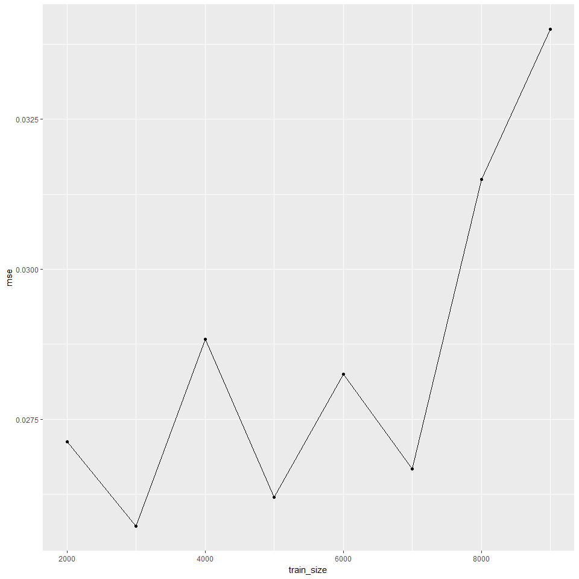

ISIL\_5\_4
================

ISIL\_5\_4\_5
-------------

This is a short excerpt of the tutorials from the ISIL book (Chapter 5.4)

Load the required librarys for the question

5 a) Fit a logistic regression model that uses income and balance to predict default.

``` r
attach(Default)
```

``` r
set.seed(1)
model.fit1 = glm(default ~ income + balance, data = Default, family = binomial)
summary(model.fit1)
```

    ## 
    ## Call:
    ## glm(formula = default ~ income + balance, family = binomial, 
    ##     data = Default)
    ## 
    ## Deviance Residuals: 
    ##     Min       1Q   Median       3Q      Max  
    ## -2.4725  -0.1444  -0.0574  -0.0211   3.7245  
    ## 
    ## Coefficients:
    ##               Estimate Std. Error z value Pr(>|z|)    
    ## (Intercept) -1.154e+01  4.348e-01 -26.545  < 2e-16 ***
    ## income       2.081e-05  4.985e-06   4.174 2.99e-05 ***
    ## balance      5.647e-03  2.274e-04  24.836  < 2e-16 ***
    ## ---
    ## Signif. codes:  0 '***' 0.001 '**' 0.01 '*' 0.05 '.' 0.1 ' ' 1
    ## 
    ## (Dispersion parameter for binomial family taken to be 1)
    ## 
    ##     Null deviance: 2920.6  on 9999  degrees of freedom
    ## Residual deviance: 1579.0  on 9997  degrees of freedom
    ## AIC: 1585
    ## 
    ## Number of Fisher Scoring iterations: 8

5 b) Using the validation set approach, estimate the test error of this model. In order to do this, you must perform the following steps: i) Split the sample set into a training set and a validation set.

``` r
train_rows <- sample(nrow(Default), nrow(Default)/2)
```

1.  Fit a multiple logistic regression model using only the training observations.

``` r
model.fit2 = glm(default ~ income + balance, data = Default[train_rows,], family = binomial)
summary(model.fit2)
```

    ## 
    ## Call:
    ## glm(formula = default ~ income + balance, family = binomial, 
    ##     data = Default[train_rows, ])
    ## 
    ## Deviance Residuals: 
    ##     Min       1Q   Median       3Q      Max  
    ## -2.3583  -0.1268  -0.0475  -0.0165   3.8116  
    ## 
    ## Coefficients:
    ##               Estimate Std. Error z value Pr(>|z|)    
    ## (Intercept) -1.208e+01  6.658e-01 -18.148   <2e-16 ***
    ## income       1.858e-05  7.573e-06   2.454   0.0141 *  
    ## balance      6.053e-03  3.467e-04  17.457   <2e-16 ***
    ## ---
    ## Signif. codes:  0 '***' 0.001 '**' 0.01 '*' 0.05 '.' 0.1 ' ' 1
    ## 
    ## (Dispersion parameter for binomial family taken to be 1)
    ## 
    ##     Null deviance: 1457.0  on 4999  degrees of freedom
    ## Residual deviance:  734.4  on 4997  degrees of freedom
    ## AIC: 740.4
    ## 
    ## Number of Fisher Scoring iterations: 8

1.  Obtain a prediction of default status for each individual in the validation set by computing the posterior probability of default for that individual, and classifying the individual to the default category if the posterior probability is greater than 0.5.

``` r
model.prob2 <-predict(model.fit2, Default[-train_rows, ], type = "response")
model.pred2 = rep("No", nrow(Default[-train_rows, ]))
model.pred2[model.prob2 > 0.5] = "Yes"
```

1.  Compute the validation set error, which is the fraction of the observations in the validation set that are misclassified.

``` r
table(model.pred2, Default[-train_rows, ]$default)
```

    ##            
    ## model.pred2   No  Yes
    ##         No  4805  115
    ##         Yes   28   52

``` r
mse2<-mean(model.pred2 != Default[-train_rows, ]$default)
mse2
```

    ## [1] 0.0286

1.  Repeat the process in (b) three times, using three different splits of the observations into a training set and a validation set. Comment on the results obtained.

``` r
train_loop <- function (i) {
    train_rows <- sample(nrow(Default), i/10*nrow(Default))
    model.fit2 = glm(default ~ income + balance, data = Default[train_rows,], family = binomial)
    summary(model.fit2)
    model.prob2 <-predict(model.fit2, Default[-train_rows, ], type = "response")
    model.pred2 = rep("No", nrow(Default[-train_rows, ]))
    model.pred2[model.prob2 > 0.5] = "Yes"
    table(model.pred2, Default[-train_rows, ]$default)
    mse2<-mean(model.pred2 != Default[-train_rows, ]$default)
    return (c(length(train_rows), mse2))
}
mse_df <- do.call("rbind", sapply(2:9, FUN = train_loop, simplify = FALSE))
colnames(mse_df) <- c("train_size", "mse")
mse_df <- data.frame(mse_df)
mse_df <- mse_df[with(mse_df,order(train_size)),]
```

Plotting the errors

``` r
ggplot(data = mse_df, aes(x=train_size, y=mse)) + geom_line() + geom_point()
```



1.  Now consider a logistic regression model that predicts the probability of default using income, balance, and a dummy variable for student. Estimate the test error for this model using the validation set approach. Comment on whether or not including a dummy variable for student leads to a reduction in the test error rate.

``` r
model.fit2 = glm(default ~ income + balance + student, data = Default[train_rows,], family = binomial)
summary(model.fit2)
```

    ## 
    ## Call:
    ## glm(formula = default ~ income + balance + student, family = binomial, 
    ##     data = Default[train_rows, ])
    ## 
    ## Deviance Residuals: 
    ##     Min       1Q   Median       3Q      Max  
    ## -2.2905  -0.1260  -0.0465  -0.0161   3.7715  
    ## 
    ## Coefficients:
    ##               Estimate Std. Error z value Pr(>|z|)    
    ## (Intercept) -1.147e+01  7.562e-01 -15.164   <2e-16 ***
    ## income       2.433e-06  1.256e-05   0.194    0.846    
    ## balance      6.124e-03  3.525e-04  17.373   <2e-16 ***
    ## studentYes  -5.608e-01  3.473e-01  -1.615    0.106    
    ## ---
    ## Signif. codes:  0 '***' 0.001 '**' 0.01 '*' 0.05 '.' 0.1 ' ' 1
    ## 
    ## (Dispersion parameter for binomial family taken to be 1)
    ## 
    ##     Null deviance: 1456.95  on 4999  degrees of freedom
    ## Residual deviance:  731.81  on 4996  degrees of freedom
    ## AIC: 739.81
    ## 
    ## Number of Fisher Scoring iterations: 8

``` r
model.prob2 <-predict(model.fit2, Default[-train_rows, ], type = "response")
model.pred2 = rep("No", nrow(Default[-train_rows, ]))
model.pred2[model.prob2 > 0.5] = "Yes"
table(model.pred2, Default[-train_rows, ]$default)
```

    ##            
    ## model.pred2   No  Yes
    ##         No  4803  114
    ##         Yes   30   53

``` r
mse2<-mean(model.pred2 != Default[-train_rows, ]$default)
table(model.pred2, Default[-train_rows, ]$default)
```

    ##            
    ## model.pred2   No  Yes
    ##         No  4803  114
    ##         Yes   30   53

``` r
mse2
```

    ## [1] 0.0288

There is no observable improvement by including the student dummy variable.

6 a) Using the summary() and glm() functions, determine the estimated standard errors for the coefficients associated with income and balance in a multiple logistic regression model that uses both predictors.

``` r
set.seed(1)
model.fit3 = glm(default ~ income + balance, data = Default, family = binomial)
summary(model.fit3)
```

    ## 
    ## Call:
    ## glm(formula = default ~ income + balance, family = binomial, 
    ##     data = Default)
    ## 
    ## Deviance Residuals: 
    ##     Min       1Q   Median       3Q      Max  
    ## -2.4725  -0.1444  -0.0574  -0.0211   3.7245  
    ## 
    ## Coefficients:
    ##               Estimate Std. Error z value Pr(>|z|)    
    ## (Intercept) -1.154e+01  4.348e-01 -26.545  < 2e-16 ***
    ## income       2.081e-05  4.985e-06   4.174 2.99e-05 ***
    ## balance      5.647e-03  2.274e-04  24.836  < 2e-16 ***
    ## ---
    ## Signif. codes:  0 '***' 0.001 '**' 0.01 '*' 0.05 '.' 0.1 ' ' 1
    ## 
    ## (Dispersion parameter for binomial family taken to be 1)
    ## 
    ##     Null deviance: 2920.6  on 9999  degrees of freedom
    ## Residual deviance: 1579.0  on 9997  degrees of freedom
    ## AIC: 1585
    ## 
    ## Number of Fisher Scoring iterations: 8

1.  Write a function, boot.fn(), that takes as input the Default data set as well as an index of the observations, and that outputs the coefficient estimates for income and balance in the multiple logistic regression model.

``` r
boot.fn <- function(data, index) {
  fit <- glm(default ~ income + balance, data = data, family = binomial, subset = index)
  return (coef(fit))
}
```

1.  Use the boot() function together with your boot.fn() function to estimate the standard errors of the logistic regression coefficients for income and balance.

``` r
library(boot)
boot(Default, boot.fn, 1000)
```

    ## 
    ## ORDINARY NONPARAMETRIC BOOTSTRAP
    ## 
    ## 
    ## Call:
    ## boot(data = Default, statistic = boot.fn, R = 1000)
    ## 
    ## 
    ## Bootstrap Statistics :
    ##          original        bias     std. error
    ## t1* -1.154047e+01 -8.008379e-03 4.239273e-01
    ## t2*  2.080898e-05  5.870933e-08 4.582525e-06
    ## t3*  5.647103e-03  2.299970e-06 2.267955e-04

7 a) Fit a logistic regression model that predicts Direction using Lag1 and Lag2.

``` r
attach(Weekly)
set.seed(1)
model.fit6 <- glm(Direction~Lag1+Lag2, data = Weekly, family = binomial)
summary(model.fit6)
```

    ## 
    ## Call:
    ## glm(formula = Direction ~ Lag1 + Lag2, family = binomial, data = Weekly)
    ## 
    ## Deviance Residuals: 
    ##    Min      1Q  Median      3Q     Max  
    ## -1.623  -1.261   1.001   1.083   1.506  
    ## 
    ## Coefficients:
    ##             Estimate Std. Error z value Pr(>|z|)    
    ## (Intercept)  0.22122    0.06147   3.599 0.000319 ***
    ## Lag1        -0.03872    0.02622  -1.477 0.139672    
    ## Lag2         0.06025    0.02655   2.270 0.023232 *  
    ## ---
    ## Signif. codes:  0 '***' 0.001 '**' 0.01 '*' 0.05 '.' 0.1 ' ' 1
    ## 
    ## (Dispersion parameter for binomial family taken to be 1)
    ## 
    ##     Null deviance: 1496.2  on 1088  degrees of freedom
    ## Residual deviance: 1488.2  on 1086  degrees of freedom
    ## AIC: 1494.2
    ## 
    ## Number of Fisher Scoring iterations: 4

1.  Fit a logistic regressionmodel that predicts Direction using Lag1 and Lag2 using all but the first observation.

``` r
attach(Weekly)
```

    ## The following objects are masked from Weekly (pos = 3):
    ## 
    ##     Direction, Lag1, Lag2, Lag3, Lag4, Lag5, Today, Volume, Year

``` r
set.seed(1)
model.fit6 <- glm(Direction~Lag1+Lag2, data = Weekly[-1,], family = binomial)
summary(model.fit6)
```

    ## 
    ## Call:
    ## glm(formula = Direction ~ Lag1 + Lag2, family = binomial, data = Weekly[-1, 
    ##     ])
    ## 
    ## Deviance Residuals: 
    ##     Min       1Q   Median       3Q      Max  
    ## -1.6258  -1.2617   0.9999   1.0819   1.5071  
    ## 
    ## Coefficients:
    ##             Estimate Std. Error z value Pr(>|z|)    
    ## (Intercept)  0.22324    0.06150   3.630 0.000283 ***
    ## Lag1        -0.03843    0.02622  -1.466 0.142683    
    ## Lag2         0.06085    0.02656   2.291 0.021971 *  
    ## ---
    ## Signif. codes:  0 '***' 0.001 '**' 0.01 '*' 0.05 '.' 0.1 ' ' 1
    ## 
    ## (Dispersion parameter for binomial family taken to be 1)
    ## 
    ##     Null deviance: 1494.6  on 1087  degrees of freedom
    ## Residual deviance: 1486.5  on 1085  degrees of freedom
    ## AIC: 1492.5
    ## 
    ## Number of Fisher Scoring iterations: 4

``` r
model.prob2 <-predict(model.fit6, Weekly[1, ], type = "response")
model.pred2 = rep("Down", nrow(Weekly[1, ]))
model.pred2[model.prob2 > 0.5] = "Up"
table(model.pred2, Weekly[1, ]$Direction)
```

    ##            
    ## model.pred2 Down Up
    ##          Up    1  0

``` r
mse2<-mean(model.pred2 != Default[1, ]$Direction)
table(model.pred2, Weekly[1, ]$Direction)
```

    ##            
    ## model.pred2 Down Up
    ##          Up    1  0

``` r
mse2
```

    ## [1] NaN
