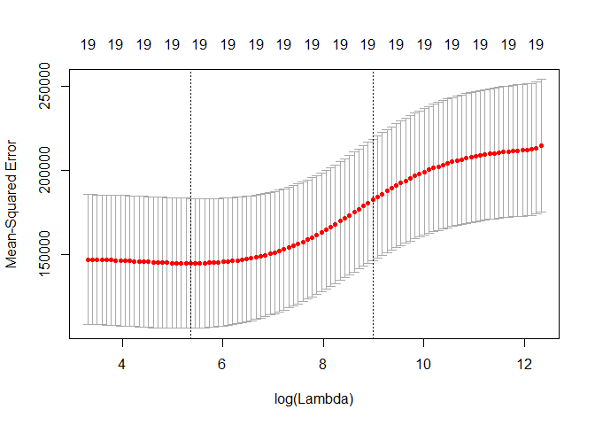

ISIL\_6\_6
================

ISIL\_6\_6 Ridge Regression and Lasso
-------------------------------------

### 6.6.1 Best Subset

The regsubsets() function (part of the leaps library) performs best subregsubsets() set selection by identifying the best model that contains a given number of predictors, where best is quantified using RSS. The syntax is the same as for lm()

Load the required librarys for the question.

The model.matrix() function is particularly useful for creating x; not only does it produce a matrix corresponding to the 19 predictors but it also automatically transforms any qualitative variables into dummy variables.

The glmnet() function standardizes the variables so that they are on the same scale

``` r
library(glmnet)
```

    ## Warning: package 'glmnet' was built under R version 3.3.3

    ## Loading required package: Matrix

    ## Loading required package: foreach

    ## Loaded glmnet 2.0-10

``` r
# grid of lambda values from 10^10 to 10^-2
grid <- 10^seq(10, -2, length=100)
ridge_reg_model <- glmnet(x, y, alpha=0, lambda=grid)
dim(coef(ridge_reg_model))
```

    ## [1]  20 100

Associated with each value of λ is a vector of ridge regression coefficients, stored in a matrix that can be accessed by coef(). In this case, it is a 20×100, with 20 rows (one for each predictor, plus an intercept) and 100 columns (one for each value of λ).

Get a bigger value of lambda vs a smaller value and compare.

``` r
# get the value of lambda
ridge_reg_model$lambda[50]
```

    ## [1] 11497.57

``` r
coef(ridge_reg_model)[, 50]
```

    ##   (Intercept)         AtBat          Hits         HmRun          Runs 
    ## 407.356050200   0.036957182   0.138180344   0.524629976   0.230701523 
    ##           RBI         Walks         Years        CAtBat         CHits 
    ##   0.239841459   0.289618741   1.107702929   0.003131815   0.011653637 
    ##        CHmRun         CRuns          CRBI        CWalks       LeagueN 
    ##   0.087545670   0.023379882   0.024138320   0.025015421   0.085028114 
    ##     DivisionW       PutOuts       Assists        Errors    NewLeagueN 
    ##  -6.215440973   0.016482577   0.002612988  -0.020502690   0.301433531

``` r
sqrt(sum(coef(ridge_reg_model)[-1, 50]^2))
```

    ## [1] 6.360612

``` r
ridge_reg_model$lambda[60]
```

    ## [1] 705.4802

``` r
coef(ridge_reg_model)[, 60]
```

    ##  (Intercept)        AtBat         Hits        HmRun         Runs 
    ##  54.32519950   0.11211115   0.65622409   1.17980910   0.93769713 
    ##          RBI        Walks        Years       CAtBat        CHits 
    ##   0.84718546   1.31987948   2.59640425   0.01083413   0.04674557 
    ##       CHmRun        CRuns         CRBI       CWalks      LeagueN 
    ##   0.33777318   0.09355528   0.09780402   0.07189612  13.68370191 
    ##    DivisionW      PutOuts      Assists       Errors   NewLeagueN 
    ## -54.65877750   0.11852289   0.01606037  -0.70358655   8.61181213

``` r
# l2 norm
sqrt(sum(coef(ridge_reg_model)[-1, 60]^2))
```

    ## [1] 57.11001

We can use the predict() function for a number of purposes. For instance, we can obtain the ridge regression coefficients for a new value of λ, say 50

``` r
predict(ridge_reg_model, s=50, type="coefficients")[1:20, ]
```

    ##   (Intercept)         AtBat          Hits         HmRun          Runs 
    ##  4.876610e+01 -3.580999e-01  1.969359e+00 -1.278248e+00  1.145892e+00 
    ##           RBI         Walks         Years        CAtBat         CHits 
    ##  8.038292e-01  2.716186e+00 -6.218319e+00  5.447837e-03  1.064895e-01 
    ##        CHmRun         CRuns          CRBI        CWalks       LeagueN 
    ##  6.244860e-01  2.214985e-01  2.186914e-01 -1.500245e-01  4.592589e+01 
    ##     DivisionW       PutOuts       Assists        Errors    NewLeagueN 
    ## -1.182011e+02  2.502322e-01  1.215665e-01 -3.278600e+00 -9.496680e+00

Next we fit a ridge regression model on the training set, and evaluate its MSE on the test set, using λ = 4. Note the use of the predict() function again. This time we get predictions for a test set, by replacing type="coefficients" with the newx argument

``` r
set.seed(1)
train = sample(1:nrow(x), nrow(x)/2)
test = (-train)
y_test = y[test]

# small lambda
ridge_model = glmnet(x[train, ], y[train], alpha=0, lambda=grid, thresh = 1e-12)
ridge_pred = predict(ridge_model, s=4, newx=x[test, ])
mean((ridge_pred - y_test)^2)
```

    ## [1] 101036.8

``` r
# large lambda
ridge_model = glmnet(x[train, ], y[train], alpha=0, lambda=grid, thresh = 1e-12)
ridge_pred = predict(ridge_model, s=1e10, newx=x[test, ])
mean((ridge_pred - y_test)^2)
```

    ## [1] 193253.1

``` r
# LS regression
ridge_model = glmnet(x[train, ], y[train], alpha=0, lambda=grid, thresh = 1e-12)
ridge_pred = predict(ridge_model, s=0, newx=x[test, ])
mean((ridge_pred - y_test)^2)
```

    ## [1] 114723.6

In this case, small lambda trumphs large lambda and Least Square, and Leas square trumphs large lambda.

Use Cross Validation to choose the Lambda value

``` r
set.seed(1)
cv_ridge_model <- cv.glmnet(x[train, ], y[train], alpha=0)
plot(cv_ridge_model)
```



``` r
best_lambda <- cv_ridge_model$lambda.min
best_lambda
```

    ## [1] 211.7416

``` r
ridge_pred = predict(cv_ridge_model, s=best_lambda, newx=x[test, ])
mean((ridge_pred - y_test)^2)
```

    ## [1] 95982.96

Refit the lambda on the full data set

``` r
out <- glmnet(x, y, alpha=0)
ridge_coeff = predict(out, type="coefficients", s=best_lambda)[1:20, ]
ridge_coeff
```

    ##  (Intercept)        AtBat         Hits        HmRun         Runs 
    ##   9.88487157   0.03143991   1.00882875   0.13927624   1.11320781 
    ##          RBI        Walks        Years       CAtBat        CHits 
    ##   0.87318990   1.80410229   0.13074381   0.01113978   0.06489843 
    ##       CHmRun        CRuns         CRBI       CWalks      LeagueN 
    ##   0.45158546   0.12900049   0.13737712   0.02908572  27.18227535 
    ##    DivisionW      PutOuts      Assists       Errors   NewLeagueN 
    ## -91.63411299   0.19149252   0.04254536  -1.81244470   7.21208390

### 6.6.2 Lasso

``` r
lasso_model <- glmnet(x[train,], y[train], alpha=1, lambda=grid)
plot(lasso_model)
```


``` r
set.seed(1)
cv_lasso_model <- cv.glmnet(x[train, ], y[train], alpha=1)
plot(cv_lasso_model)
```


``` r
best_lambda <- cv_lasso_model$lambda.min
best_lambda
```

    ## [1] 16.78016

``` r
ridge_pred = predict(cv_lasso_model, s=best_lambda, newx=x[test, ])
mean((ridge_pred - y_test)^2)
```

    ## [1] 100838.2

``` r
out=glmnet (x, y, alpha=1, lambda=grid)
lasso_coef = predict (out ,type ="coefficients", s=best_lambda )[1:20 ,]
lasso_coef
```

    ##  (Intercept)        AtBat         Hits        HmRun         Runs 
    ##   18.5394844    0.0000000    1.8735390    0.0000000    0.0000000 
    ##          RBI        Walks        Years       CAtBat        CHits 
    ##    0.0000000    2.2178444    0.0000000    0.0000000    0.0000000 
    ##       CHmRun        CRuns         CRBI       CWalks      LeagueN 
    ##    0.0000000    0.2071252    0.4130132    0.0000000    3.2666677 
    ##    DivisionW      PutOuts      Assists       Errors   NewLeagueN 
    ## -103.4845458    0.2204284    0.0000000    0.0000000    0.0000000
