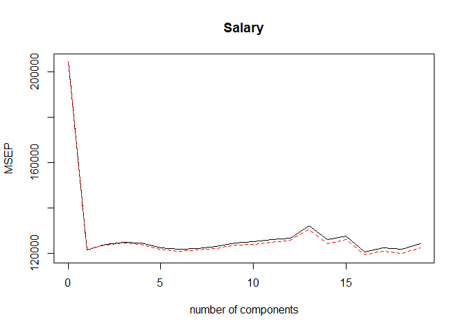
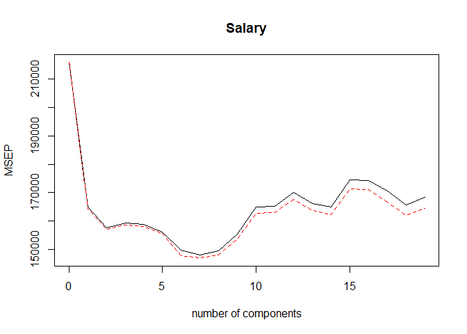
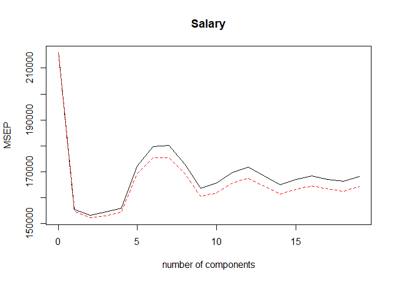

ISIL\_6\_7
================

ISIL\_6\_7 Principal Components
-------------------------------

### 6.7.1 PCR

``` r
set.seed(2)
pcr_fit1 <- pcr(Salary~., data=Hitters, scale=TRUE, validation="CV")
summary(pcr_fit1)
```

    ## Data:    X dimension: 263 19 
    ##  Y dimension: 263 1
    ## Fit method: svdpc
    ## Number of components considered: 19
    ## 
    ## VALIDATION: RMSEP
    ## Cross-validated using 10 random segments.
    ##        (Intercept)  1 comps  2 comps  3 comps  4 comps  5 comps  6 comps
    ## CV             452    348.9    352.2    353.5    352.8    350.1    349.1
    ## adjCV          452    348.7    351.8    352.9    352.1    349.3    348.0
    ##        7 comps  8 comps  9 comps  10 comps  11 comps  12 comps  13 comps
    ## CV       349.6    350.9    352.9     353.8     355.0     356.2     363.5
    ## adjCV    348.5    349.8    351.6     352.3     353.4     354.5     361.6
    ##        14 comps  15 comps  16 comps  17 comps  18 comps  19 comps
    ## CV        355.2     357.4     347.6     350.1     349.2     352.6
    ## adjCV     352.8     355.2     345.5     347.6     346.7     349.8
    ## 
    ## TRAINING: % variance explained
    ##         1 comps  2 comps  3 comps  4 comps  5 comps  6 comps  7 comps
    ## X         38.31    60.16    70.84    79.03    84.29    88.63    92.26
    ## Salary    40.63    41.58    42.17    43.22    44.90    46.48    46.69
    ##         8 comps  9 comps  10 comps  11 comps  12 comps  13 comps  14 comps
    ## X         94.96    96.28     97.26     97.98     98.65     99.15     99.47
    ## Salary    46.75    46.86     47.76     47.82     47.85     48.10     50.40
    ##         15 comps  16 comps  17 comps  18 comps  19 comps
    ## X          99.75     99.89     99.97     99.99    100.00
    ## Salary     50.55     53.01     53.85     54.61     54.61

``` r
validationplot(pcr_fit1, val.type="MSEP")
```



The MSE is lowest at M=16, which is not far off p=19. It is almost no better than Least Square Regression. The CV error is approximately similar at M=1, so using 1 component might suffice.

``` r
set.seed(1)
pcr_fit2 <- pcr(Salary~., data=Hitters, subset=train, scale=TRUE, validation="CV")
summary(pcr_fit2)
```

    ## Data:    X dimension: 131 19 
    ##  Y dimension: 131 1
    ## Fit method: svdpc
    ## Number of components considered: 19
    ## 
    ## VALIDATION: RMSEP
    ## Cross-validated using 10 random segments.
    ##        (Intercept)  1 comps  2 comps  3 comps  4 comps  5 comps  6 comps
    ## CV           464.6    406.1    397.1    399.1    398.6    395.2    386.9
    ## adjCV        464.6    405.2    396.3    398.1    397.4    394.5    384.5
    ##        7 comps  8 comps  9 comps  10 comps  11 comps  12 comps  13 comps
    ## CV       384.8    386.5    394.1     406.1     406.5     412.3     407.7
    ## adjCV    383.3    384.8    392.0     403.4     403.7     409.3     404.6
    ##        14 comps  15 comps  16 comps  17 comps  18 comps  19 comps
    ## CV        406.2     417.8     417.6     413.0     407.0     410.2
    ## adjCV     402.8     413.9     413.5     408.3     402.4     405.5
    ## 
    ## TRAINING: % variance explained
    ##         1 comps  2 comps  3 comps  4 comps  5 comps  6 comps  7 comps
    ## X         38.89    60.25    70.85    79.06    84.01    88.51    92.61
    ## Salary    28.44    31.33    32.53    33.69    36.64    40.28    40.41
    ##         8 comps  9 comps  10 comps  11 comps  12 comps  13 comps  14 comps
    ## X         95.20    96.78     97.63     98.27     98.89     99.27     99.56
    ## Salary    41.07    41.25     41.27     41.41     41.44     43.20     44.24
    ##         15 comps  16 comps  17 comps  18 comps  19 comps
    ## X          99.78     99.91     99.97    100.00    100.00
    ## Salary     44.30     45.50     49.66     51.13     51.18

``` r
validationplot(pcr_fit2, val.type="MSEP")
```



M=7 has the lowest MSE. Lets compute the test MSE

``` r
pcr_pred = predict(pcr_fit2, x[test,], ncomp=7)
mean((pcr_pred-y_test)^2)
```

    ## [1] 96556.22

Fit the PCR with M=7

``` r
pcr_fit3 <- pcr(y~x, scale=TRUE, ncomp=7)
summary(pcr_fit3)
```

    ## Data:    X dimension: 263 19 
    ##  Y dimension: 263 1
    ## Fit method: svdpc
    ## Number of components considered: 7
    ## TRAINING: % variance explained
    ##    1 comps  2 comps  3 comps  4 comps  5 comps  6 comps  7 comps
    ## X    38.31    60.16    70.84    79.03    84.29    88.63    92.26
    ## y    40.63    41.58    42.17    43.22    44.90    46.48    46.69

### 6.7.2 PLS

``` r
set.seed(1)
pls_fit4 <- plsr(Salary~., data=Hitters, subset=train, scale=TRUE, validation="CV")
summary(pls_fit4)
```

    ## Data:    X dimension: 131 19 
    ##  Y dimension: 131 1
    ## Fit method: kernelpls
    ## Number of components considered: 19
    ## 
    ## VALIDATION: RMSEP
    ## Cross-validated using 10 random segments.
    ##        (Intercept)  1 comps  2 comps  3 comps  4 comps  5 comps  6 comps
    ## CV           464.6    394.2    391.5    393.1    395.0    415.0    424.0
    ## adjCV        464.6    393.4    390.2    391.1    392.9    411.5    418.8
    ##        7 comps  8 comps  9 comps  10 comps  11 comps  12 comps  13 comps
    ## CV       424.5    415.8    404.6     407.1     412.0     414.4     410.3
    ## adjCV    418.9    411.4    400.7     402.2     407.2     409.3     405.6
    ##        14 comps  15 comps  16 comps  17 comps  18 comps  19 comps
    ## CV        406.2     408.6     410.5     408.8     407.8     410.2
    ## adjCV     401.8     403.9     405.6     404.1     403.2     405.5
    ## 
    ## TRAINING: % variance explained
    ##         1 comps  2 comps  3 comps  4 comps  5 comps  6 comps  7 comps
    ## X         38.12    53.46    66.05    74.49    79.33    84.56    87.09
    ## Salary    33.58    38.96    41.57    42.43    44.04    45.59    47.05
    ##         8 comps  9 comps  10 comps  11 comps  12 comps  13 comps  14 comps
    ## X         90.74    92.55     93.94     97.23     97.88     98.35     98.85
    ## Salary    47.53    48.42     49.68     50.04     50.54     50.78     50.92
    ##         15 comps  16 comps  17 comps  18 comps  19 comps
    ## X          99.11     99.43     99.78     99.99    100.00
    ## Salary     51.04     51.11     51.15     51.16     51.18

``` r
validationplot(pls_fit4, val.type="MSEP")
```



Optimal at M=2. Evaluating the corresponding test set.

``` r
pls_pred1 <- predict(pls_fit4, x[test,], ncomp=2)
mean((pls_pred1 - y_test)^2)
```

    ## [1] 101417.5

Slightly higher than the other methods.

Fit the PCR with M=2

``` r
pls_fit1 <- plsr(y~x, scale=TRUE, ncomp=2)
summary(pls_fit1)
```

    ## Data:    X dimension: 263 19 
    ##  Y dimension: 263 1
    ## Fit method: kernelpls
    ## Number of components considered: 2
    ## TRAINING: % variance explained
    ##    1 comps  2 comps
    ## X    38.08    51.03
    ## y    43.05    46.40

Notice that the percentage of variance in Salary that the two-component PLS fit explains, 46.40%, is almost as much as that explained using the 6.8 Exercises 259 final seven-component model PCR fit, 46.69 %. This is because PCR only attempts to maximize the amount of variance explained in the predictors, while PLS searches for directions that explain variance in both the predictors and the response.
