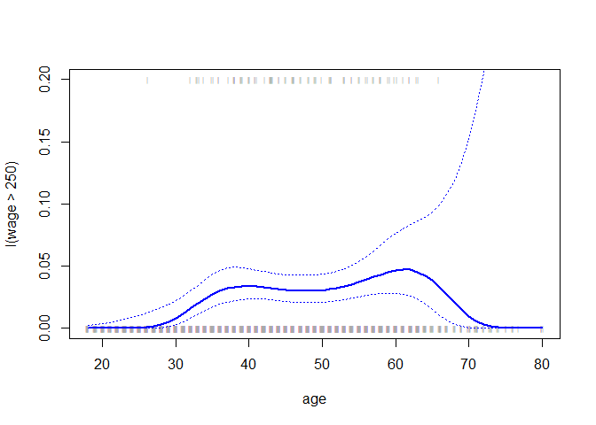
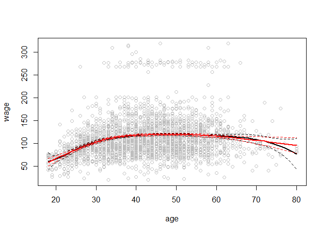
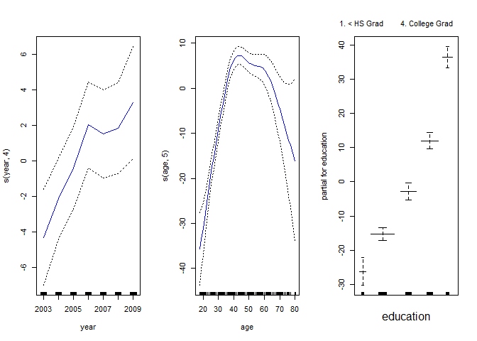
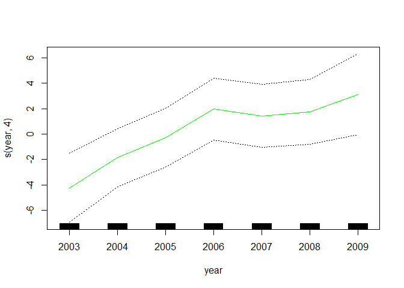
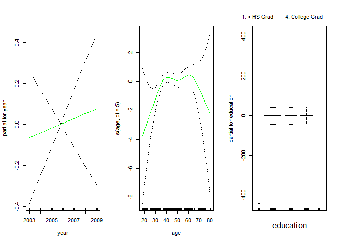

ISIL\_7\_8
================

ISIL\_7\_8 Non Linear MOdelling
-------------------------------

### 7.8.1 Polynomail Regression and Step Functions

Fit the age to wage with linear regression.

``` r
fit1 = lm(wage~poly(age, 4), data=Wage)
coef(summary(fit1))
```

    ##                 Estimate Std. Error    t value     Pr(>|t|)
    ## (Intercept)    111.70361  0.7287409 153.283015 0.000000e+00
    ## poly(age, 4)1  447.06785 39.9147851  11.200558 1.484604e-28
    ## poly(age, 4)2 -478.31581 39.9147851 -11.983424 2.355831e-32
    ## poly(age, 4)3  125.52169 39.9147851   3.144742 1.678622e-03
    ## poly(age, 4)4  -77.91118 39.9147851  -1.951938 5.103865e-02

The generated coefficients are orthogonal polynomials, meaning that each value is a linear combination of the predictors.

To obtain the predictor's cofficients directly:

``` r
fit2 = lm(wage~poly(age, 4, raw=T), data=Wage)
coef(summary(fit2))
```

    ##                             Estimate   Std. Error   t value     Pr(>|t|)
    ## (Intercept)            -1.841542e+02 6.004038e+01 -3.067172 0.0021802539
    ## poly(age, 4, raw = T)1  2.124552e+01 5.886748e+00  3.609042 0.0003123618
    ## poly(age, 4, raw = T)2 -5.638593e-01 2.061083e-01 -2.735743 0.0062606446
    ## poly(age, 4, raw = T)3  6.810688e-03 3.065931e-03  2.221409 0.0263977518
    ## poly(age, 4, raw = T)4 -3.203830e-05 1.641359e-05 -1.951938 0.0510386498

To create the polynomial basis functions on the fly, protecting the terms with I():

``` r
fit3 = lm(wage~age + I(age^2) + I(age^3) + I(age^4), data=Wage)
coef(summary(fit2))
```

    ##                             Estimate   Std. Error   t value     Pr(>|t|)
    ## (Intercept)            -1.841542e+02 6.004038e+01 -3.067172 0.0021802539
    ## poly(age, 4, raw = T)1  2.124552e+01 5.886748e+00  3.609042 0.0003123618
    ## poly(age, 4, raw = T)2 -5.638593e-01 2.061083e-01 -2.735743 0.0062606446
    ## poly(age, 4, raw = T)3  6.810688e-03 3.065931e-03  2.221409 0.0263977518
    ## poly(age, 4, raw = T)4 -3.203830e-05 1.641359e-05 -1.951938 0.0510386498

Create a grid of age values for the purpose of predictions

``` r
agelims = range(Wage$age)
agelims
```

    ## [1] 18 80

``` r
age_grid = seq(from=agelims[1], to=agelims[2])
preds = predict(fit1, newdata = list(age=age_grid), se=TRUE)
# Get the C.I of the predictions
se_bands = cbind(preds$fit+2*preds$se.fit, preds$fit-2*preds$se.fit)
head(se_bands, 5)
```

    ##       [,1]     [,2]
    ## 1 62.52799 41.33491
    ## 2 67.23827 49.75522
    ## 3 71.75608 57.38768
    ## 4 76.09436 64.27111
    ## 5 80.26558 70.44323

Now plot the predictions:

``` r
par(mfrow =c(1,2) ,mar=c(4.5 ,4.5 ,1 ,1) ,oma=c(0,0,4,0))
plot(age ,wage ,xlim=agelims ,cex =.5, col =" darkgrey ")
title (" Degree -4 Polynomial ",outer =T)
lines(age_grid ,preds$fit ,lwd =2, col =" blue")
matlines (age_grid ,se_bands ,lwd =1, col =" blue",lty =3)
```


Below shows that there is hardly any difference between orthogonal polynomial fits and polynomial basis functions:

``` r
pred2 = predict(fit2, newdata = list(age=age_grid), se=TRUE)
max(abs(preds$fit - pred2$fit))
```

    ## [1] 7.81597e-11

``` r
par(mfrow =c(1,2) ,mar=c(4.5 ,4.5 ,1 ,1) ,oma=c(0,0,4,0))
plot(age ,wage ,xlim=agelims ,cex =.5, col =" darkgrey ")
title (" Degree -4 Polynomial ",outer =T)
lines(age_grid ,pred2$fit ,lwd =2, col =" blue")
matlines (age_grid ,se_bands ,lwd =1, col =" blue",lty =3)
```


Use ANOVA to determine the number of df to use in the fit, and test the null hypothesis

``` r
fit_1 = lm(wage~age, data=Wage)
fit_2 = lm(wage~poly(age, 2), data=Wage)
fit_3 = lm(wage~poly(age, 3), data=Wage)
fit_4 = lm(wage~poly(age, 4), data=Wage)
fit_5 = lm(wage~poly(age, 5), data=Wage)
anova(fit_1, fit_2, fit_3, fit_4, fit_5)
```

    ## Analysis of Variance Table
    ## 
    ## Model 1: wage ~ age
    ## Model 2: wage ~ poly(age, 2)
    ## Model 3: wage ~ poly(age, 3)
    ## Model 4: wage ~ poly(age, 4)
    ## Model 5: wage ~ poly(age, 5)
    ##   Res.Df     RSS Df Sum of Sq        F    Pr(>F)    
    ## 1   2998 5022216                                    
    ## 2   2997 4793430  1    228786 143.5931 < 2.2e-16 ***
    ## 3   2996 4777674  1     15756   9.8888  0.001679 ** 
    ## 4   2995 4771604  1      6070   3.8098  0.051046 .  
    ## 5   2994 4770322  1      1283   0.8050  0.369682    
    ## ---
    ## Signif. codes:  0 '***' 0.001 '**' 0.01 '*' 0.05 '.' 0.1 ' ' 1

It shows that fit\_1 is inadequate, and the ANOVA for fit\_3 with fit\_4 indicates that the model fits best when its cubic or quartic.

The above can also be achived with the coefficient summary shown below. The square t-statistic value is equal to f-stat

``` r
coef(summary(fit_5))
```

    ##                 Estimate Std. Error     t value     Pr(>|t|)
    ## (Intercept)    111.70361  0.7287647 153.2780243 0.000000e+00
    ## poly(age, 5)1  447.06785 39.9160847  11.2001930 1.491111e-28
    ## poly(age, 5)2 -478.31581 39.9160847 -11.9830341 2.367734e-32
    ## poly(age, 5)3  125.52169 39.9160847   3.1446392 1.679213e-03
    ## poly(age, 5)4  -77.91118 39.9160847  -1.9518743 5.104623e-02
    ## poly(age, 5)5  -35.81289 39.9160847  -0.8972045 3.696820e-01

``` r
(-11.983034)^2
```

    ## [1] 143.5931

Below is an implementation of Logistic Regression for when the wage is more than 250K:

``` r
fit_6 = glm(I(wage>250)~poly(age, 4), data=Wage, family=binomial)
preds3 = predict(fit_6, newdata=list(age=age_grid), se=T)
pfit = exp(preds3$fit)/(1+exp(preds3$fit))
se_bands_logit = cbind(preds3$fit+2*preds3$se.fit, preds3$fit-2*preds3$se.fit)
se_bands = exp(se_bands_logit)/(1+exp(se_bands_logit))
```

The logits could have been calculated directly with family=response, but that would've resulted in negative probabilities, and hence the C.I calculations wouldn't have been possible.

``` r
plot(age ,I(wage >250) ,xlim=agelims ,type ="n",ylim=c(0 ,.2))
points(jitter(age), I((wage >250)/5) ,cex =.5, pch ="|", col =" darkgrey ")
lines(age_grid ,pfit ,lwd=2, col =" blue")
matlines(age_grid ,se_bands ,lwd=1, col="blue",lty =3)
```



The Step function implementation is as shown below:

``` r
table(cut(age, 4))
```

    ## 
    ## (17.9,33.5]   (33.5,49]   (49,64.5] (64.5,80.1] 
    ##         750        1399         779          72

``` r
fit_7 = lm(wage~cut(age, 4), data=Wage)
coef(summary(fit_7))
```

    ##                         Estimate Std. Error   t value     Pr(>|t|)
    ## (Intercept)            94.158392   1.476069 63.789970 0.000000e+00
    ## cut(age, 4)(33.5,49]   24.053491   1.829431 13.148074 1.982315e-38
    ## cut(age, 4)(49,64.5]   23.664559   2.067958 11.443444 1.040750e-29
    ## cut(age, 4)(64.5,80.1]  7.640592   4.987424  1.531972 1.256350e-01

The intercept of $94,158 is interpreted as the salary for people with the ages below 33.5, with the subsequents salaries as an addition to the base salary of $94,158.

7.8.2 Splines
-------------

Default of cubic splines are created with the basis spline function.

``` r
library(splines)
fit_8 = lm(wage~bs(age, knots=c(25, 40, 60)), data=Wage)
pred4 = predict(fit_8, newdata=list(age=age_grid), se=T)
plot(age ,wage ,col ="gray")
lines(age_grid ,pred4$fit ,lwd =2)
lines(age_grid ,pred4$fit+2*pred4$se ,lty ="dashed")
lines(age_grid ,pred4$fit-2*pred4$se ,lty ="dashed")
```


The df option also allows one to specify the degrees of freedom

``` r
dim(bs(age, knots=c(25, 40, 60)))
```

    ## [1] 3000    6

``` r
dim(bs(age, df=6))
```

    ## [1] 3000    6

``` r
attr(bs(age, df=6), "knots")
```

    ##   25%   50%   75% 
    ## 33.75 42.00 51.00

To fit a natural spline, use the ns() function:

``` r
fit_9 = lm(wage~ns(age, df=4), data=Wage)
pred5 = predict(fit_9, newdata=list(age=age_grid), se=T)
plot(age ,wage ,col ="gray")
lines(age_grid ,pred4$fit ,lwd =2)
lines(age_grid ,pred4$fit+2*pred4$se ,lty ="dashed")
lines(age_grid ,pred4$fit-2*pred4$se ,lty ="dashed")
lines(age_grid, pred5$fit, col="red", lwd=2)
lines(age_grid ,pred5$fit+2*pred5$se ,lty ="dashed", col="red")
lines(age_grid ,pred5$fit-2*pred5$se ,lty ="dashed", col="red")
```



The Smoothing Spline imposes constraints and penalty on flexibility, which prevents the overfitting of the training data, allowing a more general model:

``` r
plot(age ,wage , xlim=agelims, cex=.5, col ="darkgrey")
title("Smoothing Spline")
fit_10 = smooth.spline(age, wage, df=16)
fit_10$df
```

    ## [1] 16.00237

``` r
fit_11 = smooth.spline(age, wage, cv=TRUE)
```

    ## Warning in smooth.spline(age, wage, cv = TRUE): cross-validation with non-
    ## unique 'x' values seems doubtful

``` r
fit_11$df
```

    ## [1] 6.794596

``` r
lines(fit_10, col="red", lwd=2)
lines(fit_11, col="blue", lwd=2)
legend ("topright",legend =c("16 DF " ,"6.8 DF"), col=c("red","blue"),lty =1, lwd =2, cex =.8)
```

 The smoothing spline reduced the df from 16 to 6.8

Below is an implementation of Local Regression using the loess() function. The larger the span, the smaller the df, the smoother the fit.locfit() can also be used in R:

``` r
plot(age, wage, xlim=agelims , cex =.5, col="darkgrey")
title("Local Regression")
fit_12 = loess(wage~age, span=.2, data=Wage)
fit_13 = loess(wage~age, span=.5, data=Wage)
lines(age_grid ,predict (fit_12 ,data.frame(age=age_grid)), col="red", lwd=2)
lines(age_grid ,predict (fit_13 ,data.frame(age=age_grid)), col="blue", lwd=2)
legend ("topright",legend =c("Span=0.2" , "Span =0.5") , col=c("red", "blue"), lty =1, lwd=2, cex=.8)
```


7.8.3 GAMs

Below is an example implmentation of a GAM fit, using the simple lm() function:

``` r
gam1 = lm(wage~ns(year, 4)+ns(age, 5)+education, data=Wage)
```

Below is an implementation of GAM with smoothing splines using the gam library and s() function

``` r
library(gam)
```

    ## Warning: package 'gam' was built under R version 3.3.3

    ## Loading required package: foreach

    ## Loaded gam 1.14-4

``` r
gam2 = gam(wage~s(year, 4)+s(age, 5)+education, data=Wage)
par(mfrow=c(1, 3))
plot.gam(gam2, se=TRUE, col="blue")
```



``` r
plot.gam(gam1, se=TRUE, col="red")
```


``` r
gam3 = gam(wage~s(age, 5)+education, data=Wage)
gam4 = gam(wage~year+s(age, 5)+education, data=Wage)
anova(gam3, gam4, gam2)
```

    ## Analysis of Deviance Table
    ## 
    ## Model 1: wage ~ s(age, 5) + education
    ## Model 2: wage ~ year + s(age, 5) + education
    ## Model 3: wage ~ s(year, 4) + s(age, 5) + education
    ##   Resid. Df Resid. Dev Df Deviance  Pr(>Chi)    
    ## 1      2990    3711731                          
    ## 2      2989    3693842  1  17889.2 0.0001419 ***
    ## 3      2986    3689770  3   4071.1 0.3483897    
    ## ---
    ## Signif. codes:  0 '***' 0.001 '**' 0.01 '*' 0.05 '.' 0.1 ' ' 1

The above shows that Model 2 with a linear function of year is more statistically significant than the model without the year predictor. There is no evidence that the GAM with the non-linear function of year (Model 3) is more statistically significant than Model 2.

The summary() function produces a summary to the gam fit. The p-values for year and age correspond to a null hypothesis of a linear relationship versus the alternative of a non-linear relationship. This can be further confirmed with the plot for year:

``` r
summary(gam2)
```

    ## 
    ## Call: gam(formula = wage ~ s(year, 4) + s(age, 5) + education, data = Wage)
    ## Deviance Residuals:
    ##     Min      1Q  Median      3Q     Max 
    ## -119.43  -19.70   -3.33   14.17  213.48 
    ## 
    ## (Dispersion Parameter for gaussian family taken to be 1235.69)
    ## 
    ##     Null Deviance: 5222086 on 2999 degrees of freedom
    ## Residual Deviance: 3689770 on 2986 degrees of freedom
    ## AIC: 29887.75 
    ## 
    ## Number of Local Scoring Iterations: 2 
    ## 
    ## Anova for Parametric Effects
    ##              Df  Sum Sq Mean Sq F value    Pr(>F)    
    ## s(year, 4)    1   27162   27162  21.981 2.877e-06 ***
    ## s(age, 5)     1  195338  195338 158.081 < 2.2e-16 ***
    ## education     4 1069726  267432 216.423 < 2.2e-16 ***
    ## Residuals  2986 3689770    1236                      
    ## ---
    ## Signif. codes:  0 '***' 0.001 '**' 0.01 '*' 0.05 '.' 0.1 ' ' 1
    ## 
    ## Anova for Nonparametric Effects
    ##             Npar Df Npar F  Pr(F)    
    ## (Intercept)                          
    ## s(year, 4)        3  1.086 0.3537    
    ## s(age, 5)         4 32.380 <2e-16 ***
    ## education                            
    ## ---
    ## Signif. codes:  0 '***' 0.001 '**' 0.01 '*' 0.05 '.' 0.1 ' ' 1

To make predictions for Model 2:

``` r
pred6 = predict(gam4, newdata=Wage)
```

To include Local Regression with the GAM:

``` r
gam5 = gam(wage~s(year, 4)+lo(age, span=0.7)+education, data=Wage)
plot.gam(gam5, se=TRUE, col="green")
```



Using the Local Regression function with interactions between year and age:

``` r
gam6 = gam(wage~lo(year, age, span=0.5)+education, data=Wage)
```

    ## Warning in lo.wam(x, z, wz, fit$smooth, which, fit$smooth.frame,
    ## bf.maxit, : liv too small. (Discovered by lowesd)

    ## Warning in lo.wam(x, z, wz, fit$smooth, which, fit$smooth.frame,
    ## bf.maxit, : lv too small. (Discovered by lowesd)

    ## Warning in lo.wam(x, z, wz, fit$smooth, which, fit$smooth.frame,
    ## bf.maxit, : liv too small. (Discovered by lowesd)

    ## Warning in lo.wam(x, z, wz, fit$smooth, which, fit$smooth.frame,
    ## bf.maxit, : lv too small. (Discovered by lowesd)

``` r
library (akima)
```

    ## Warning: package 'akima' was built under R version 3.3.3

``` r
plot(gam6)
```


To fit GAM with Logistic Regression, use the I() function:

``` r
gam7 = gam(I(wage > 250)~year+s(age, df=5)+education, data=Wage, family=binomial)
par(mfrow=c(1, 3))
plot.gam(gam7, se=T, col="green")
```



As shown in the below table, there are no high earners below the HighSchool category:

``` r
table(education, I(wage >250))
```

    ##                     
    ## education            FALSE TRUE
    ##   1. < HS Grad         268    0
    ##   2. HS Grad           966    5
    ##   3. Some College      643    7
    ##   4. College Grad      663   22
    ##   5. Advanced Degree   381   45

So we will refit the model without sample below the HighSchool category, which will provide clearer results:

``` r
gam7 = gam(I(wage > 250)~year+s(age, df=5)+education, data=Wage, family=binomial, subset=(education !="1. < HS Grad"))
par(mfrow=c(1, 3))
plot.gam(gam7, se=T, col="green")
```


