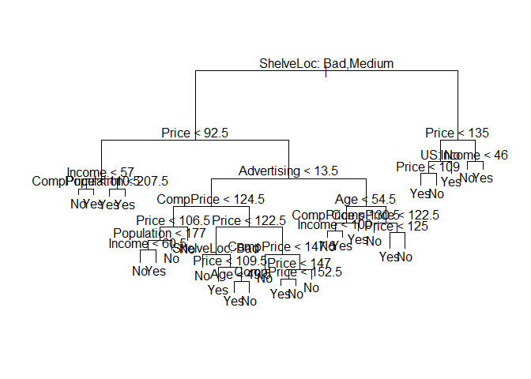
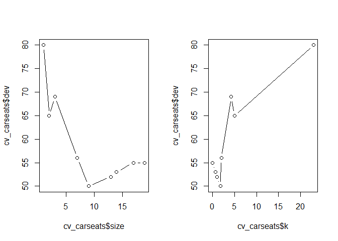
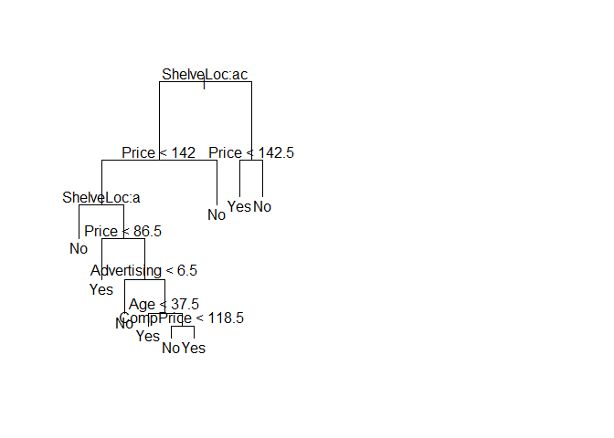
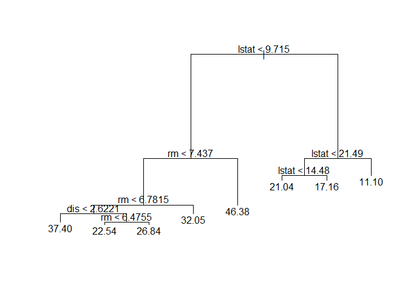
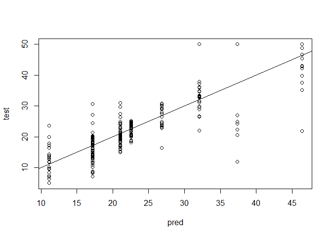
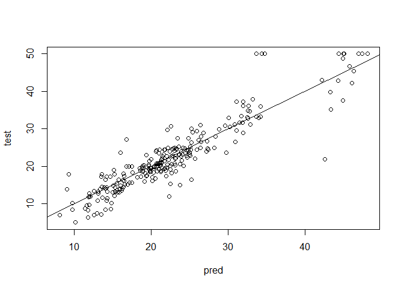
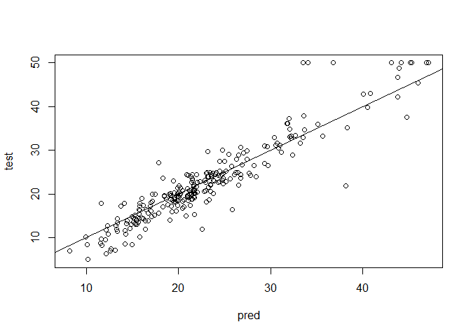
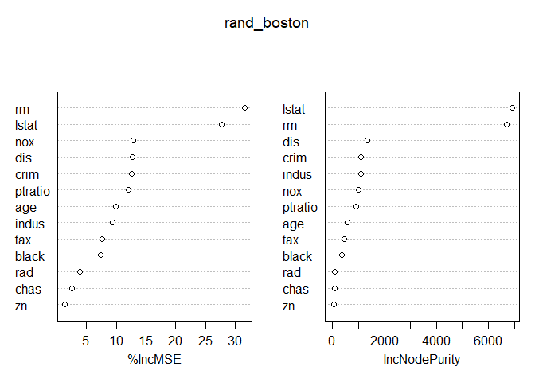
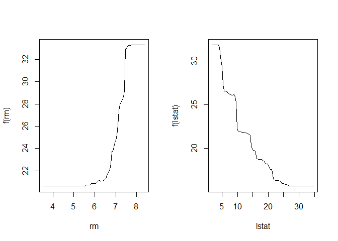

ISIL\_8\_3
================

ISIL\_8\_3 Decision Trees
-------------------------

### 8.3.1 Fitting Classification Trees

``` r
library(ISLR)
```

    ## Warning: package 'ISLR' was built under R version 3.3.3

``` r
library(tree)
```

    ## Warning: package 'tree' was built under R version 3.3.3

``` r
attach(Carseats)
```

Fit all the predictors except Sales to High response using a Decision Tree.

``` r
Carseats$High <- ifelse(Carseats$Sales<=8, "No", "Yes")
Carseats$High <- as.factor(Carseats$High)
tree_carseats = tree(High~.-Sales, Carseats)
summary(tree_carseats)
```

    ## 
    ## Classification tree:
    ## tree(formula = High ~ . - Sales, data = Carseats)
    ## Variables actually used in tree construction:
    ## [1] "ShelveLoc"   "Price"       "Income"      "CompPrice"   "Population" 
    ## [6] "Advertising" "Age"         "US"         
    ## Number of terminal nodes:  27 
    ## Residual mean deviance:  0.4575 = 170.7 / 373 
    ## Misclassification error rate: 0.09 = 36 / 400

Plot the decision tree.

``` r
tree_carseats
```

    ## node), split, n, deviance, yval, (yprob)
    ##       * denotes terminal node
    ## 
    ##   1) root 400 541.500 No ( 0.59000 0.41000 )  
    ##     2) ShelveLoc: Bad,Medium 315 390.600 No ( 0.68889 0.31111 )  
    ##       4) Price < 92.5 46  56.530 Yes ( 0.30435 0.69565 )  
    ##         8) Income < 57 10  12.220 No ( 0.70000 0.30000 )  
    ##          16) CompPrice < 110.5 5   0.000 No ( 1.00000 0.00000 ) *
    ##          17) CompPrice > 110.5 5   6.730 Yes ( 0.40000 0.60000 ) *
    ##         9) Income > 57 36  35.470 Yes ( 0.19444 0.80556 )  
    ##          18) Population < 207.5 16  21.170 Yes ( 0.37500 0.62500 ) *
    ##          19) Population > 207.5 20   7.941 Yes ( 0.05000 0.95000 ) *
    ##       5) Price > 92.5 269 299.800 No ( 0.75465 0.24535 )  
    ##        10) Advertising < 13.5 224 213.200 No ( 0.81696 0.18304 )  
    ##          20) CompPrice < 124.5 96  44.890 No ( 0.93750 0.06250 )  
    ##            40) Price < 106.5 38  33.150 No ( 0.84211 0.15789 )  
    ##              80) Population < 177 12  16.300 No ( 0.58333 0.41667 )  
    ##               160) Income < 60.5 6   0.000 No ( 1.00000 0.00000 ) *
    ##               161) Income > 60.5 6   5.407 Yes ( 0.16667 0.83333 ) *
    ##              81) Population > 177 26   8.477 No ( 0.96154 0.03846 ) *
    ##            41) Price > 106.5 58   0.000 No ( 1.00000 0.00000 ) *
    ##          21) CompPrice > 124.5 128 150.200 No ( 0.72656 0.27344 )  
    ##            42) Price < 122.5 51  70.680 Yes ( 0.49020 0.50980 )  
    ##              84) ShelveLoc: Bad 11   6.702 No ( 0.90909 0.09091 ) *
    ##              85) ShelveLoc: Medium 40  52.930 Yes ( 0.37500 0.62500 )  
    ##               170) Price < 109.5 16   7.481 Yes ( 0.06250 0.93750 ) *
    ##               171) Price > 109.5 24  32.600 No ( 0.58333 0.41667 )  
    ##                 342) Age < 49.5 13  16.050 Yes ( 0.30769 0.69231 ) *
    ##                 343) Age > 49.5 11   6.702 No ( 0.90909 0.09091 ) *
    ##            43) Price > 122.5 77  55.540 No ( 0.88312 0.11688 )  
    ##              86) CompPrice < 147.5 58  17.400 No ( 0.96552 0.03448 ) *
    ##              87) CompPrice > 147.5 19  25.010 No ( 0.63158 0.36842 )  
    ##               174) Price < 147 12  16.300 Yes ( 0.41667 0.58333 )  
    ##                 348) CompPrice < 152.5 7   5.742 Yes ( 0.14286 0.85714 ) *
    ##                 349) CompPrice > 152.5 5   5.004 No ( 0.80000 0.20000 ) *
    ##               175) Price > 147 7   0.000 No ( 1.00000 0.00000 ) *
    ##        11) Advertising > 13.5 45  61.830 Yes ( 0.44444 0.55556 )  
    ##          22) Age < 54.5 25  25.020 Yes ( 0.20000 0.80000 )  
    ##            44) CompPrice < 130.5 14  18.250 Yes ( 0.35714 0.64286 )  
    ##              88) Income < 100 9  12.370 No ( 0.55556 0.44444 ) *
    ##              89) Income > 100 5   0.000 Yes ( 0.00000 1.00000 ) *
    ##            45) CompPrice > 130.5 11   0.000 Yes ( 0.00000 1.00000 ) *
    ##          23) Age > 54.5 20  22.490 No ( 0.75000 0.25000 )  
    ##            46) CompPrice < 122.5 10   0.000 No ( 1.00000 0.00000 ) *
    ##            47) CompPrice > 122.5 10  13.860 No ( 0.50000 0.50000 )  
    ##              94) Price < 125 5   0.000 Yes ( 0.00000 1.00000 ) *
    ##              95) Price > 125 5   0.000 No ( 1.00000 0.00000 ) *
    ##     3) ShelveLoc: Good 85  90.330 Yes ( 0.22353 0.77647 )  
    ##       6) Price < 135 68  49.260 Yes ( 0.11765 0.88235 )  
    ##        12) US: No 17  22.070 Yes ( 0.35294 0.64706 )  
    ##          24) Price < 109 8   0.000 Yes ( 0.00000 1.00000 ) *
    ##          25) Price > 109 9  11.460 No ( 0.66667 0.33333 ) *
    ##        13) US: Yes 51  16.880 Yes ( 0.03922 0.96078 ) *
    ##       7) Price > 135 17  22.070 No ( 0.64706 0.35294 )  
    ##        14) Income < 46 6   0.000 No ( 1.00000 0.00000 ) *
    ##        15) Income > 46 11  15.160 Yes ( 0.45455 0.54545 ) *

``` r
plot(tree_carseats)
text(tree_carseats, pretty=0)
```

 ShelveLoc look to be the most important predictor.

Compute the test error.

``` r
set.seed(2)
train = sample(1:nrow(Carseats), 200)
Carseats_test = Carseats[-train, ]
High_test = Carseats$High[-train]
tree_carseats = tree(High~.-Sales, Carseats, subset = train)
tree_pred = predict(tree_carseats, Carseats_test, type="class")
table_test = table(tree_pred, High_test)
(table_test[1]+table_test[4])/(table_test[1]+table_test[2]+table_test[3]+table_test[4])
```

    ## [1] 0.715

Pruning the tree

``` r
set.seed(3)
cv_carseats = cv.tree(tree_carseats, FUN=prune.misclass)
par(mfrow=c(1, 2))
plot(cv_carseats$size, cv_carseats$dev, type="b")
plot(cv_carseats$k, cv_carseats$dev, type="b")
```



``` r
prune_carseats = prune.misclass(tree_carseats, best=cv_carseats$size[which.min(cv_carseats$dev)])
plot(prune_carseats)
text(prune_carseats)
```



Prediction accuracy on pruned tree

``` r
tree_pred = predict(prune_carseats, Carseats_test, type="class")
table_test = table(tree_pred, High_test)
table_test
```

    ##          High_test
    ## tree_pred No Yes
    ##       No  94  24
    ##       Yes 22  60

``` r
(table_test[1]+table_test[4])/(table_test[1]+table_test[2]+table_test[3]+table_test[4])
```

    ## [1] 0.77

### 8.3.2 Fitting Regression Trees

``` r
library(MASS)
```

Using the Boston data, 3 predictors were used in the fitting of the regression tree, with 8 terminal nodes

``` r
set.seed(1)
train = sample(1:nrow(Boston), nrow(Boston)/2)
tree_boston = tree(medv~., Boston, subset=train)
summary(tree_boston)
```

    ## 
    ## Regression tree:
    ## tree(formula = medv ~ ., data = Boston, subset = train)
    ## Variables actually used in tree construction:
    ## [1] "lstat" "rm"    "dis"  
    ## Number of terminal nodes:  8 
    ## Residual mean deviance:  12.65 = 3099 / 245 
    ## Distribution of residuals:
    ##      Min.   1st Qu.    Median      Mean   3rd Qu.      Max. 
    ## -14.10000  -2.04200  -0.05357   0.00000   1.96000  12.60000

Plot the tree. It shows that a lower lstat value correlates with a higher real estate median price.(lstat &lt; 9.715 and rm &gt;= 7.437)

``` r
plot(tree_boston)
text(tree_boston, pretty=0)
```



Use CV to prune the tree. The tree has been pruned to 7 terminal nodes, which is not far off the 8 terminal nodes associated with the original tree

``` r
cv_tree_boston = cv.tree(tree_boston)
best=cv_tree_boston$size[which.min(cv_tree_boston$dev)]
best
```

    ## [1] 8

``` r
prune_boston = prune.tree(tree_boston, best=best)
```

What is the prediction accuracy on the unpruned tree? (MSE)

``` r
pred = predict(tree_boston, newdata = Boston[-train,])
test = Boston[-train,]$medv
plot(pred, test)
abline(0, 1)
```



``` r
mean((pred-test)^2)
```

    ## [1] 25.04559

``` r
sqrt(mean((pred-test)^2))
```

    ## [1] 5.004557

The tree is predicting within RMSE of $5004.56 of the test data.

What is the prediction accuracy on the unpruned tree? (MSE)

``` r
pred = predict(prune_boston, newdata = Boston[-train,])
test = Boston[-train,]$medv
plot(pred, test)
abline(0, 1)
```


``` r
mean((pred-test)^2)
```

    ## [1] 25.04559

``` r
sqrt(mean((pred-test)^2))
```

    ## [1] 5.004557

Not better than the unpruned tree.

8.3.3 Bagging and Random Forests
--------------------------------

``` r
library(randomForest)
```

    ## randomForest 4.6-12

    ## Type rfNews() to see new features/changes/bug fixes.

``` r
set.seed(1)
```

The mtry=13 parameter implies all predictors to be considered

``` r
bag_boston = randomForest(medv~., data=Boston, subset=train, mtry=length(colnames(Boston))-1, importance=TRUE)
bag_boston
```

    ## 
    ## Call:
    ##  randomForest(formula = medv ~ ., data = Boston, mtry = length(colnames(Boston)) -      1, importance = TRUE, subset = train) 
    ##                Type of random forest: regression
    ##                      Number of trees: 500
    ## No. of variables tried at each split: 13
    ## 
    ##           Mean of squared residuals: 11.02509
    ##                     % Var explained: 86.65

The prediction performance of bagging is almost 1/2 that of a pruned tree. The predictions are within $3645.37 of the actual median price.

``` r
pred = predict(bag_boston, newdata=Boston[-train, ])
plot(pred, test)
abline(0, 1)
```


``` r
mean((pred-test)^2)
```

    ## [1] 13.47349

``` r
sqrt(mean((pred-test)^2))
```

    ## [1] 3.670625

The tree growth limit can also be stipulated. (RMSE of $3986.58)

``` r
bag_boston = randomForest(medv~., data=Boston, subset=train, mtry=length(colnames(Boston))-1, ntree=25)
pred = predict(bag_boston, newdata=Boston[-train, ])
plot(pred, test)
abline(0, 1)
```



``` r
mean((pred-test)^2)
```

    ## [1] 13.43068

``` r
sqrt(mean((pred-test)^2))
```

    ## [1] 3.664789

Fit the training data against a Random Forest model with a limit of 6 predictors

``` r
set.seed(1)
rand_boston = randomForest(medv~., data=Boston, subset=train, mtry=6, importance=TRUE)
rand_boston
```

    ## 
    ## Call:
    ##  randomForest(formula = medv ~ ., data = Boston, mtry = 6, importance = TRUE,      subset = train) 
    ##                Type of random forest: regression
    ##                      Number of trees: 500
    ## No. of variables tried at each split: 6
    ## 
    ##           Mean of squared residuals: 12.09928
    ##                     % Var explained: 85.35

``` r
pred = predict(rand_boston, newdata=Boston[-train, ])
plot(pred, test)
abline(0, 1)
```



``` r
mean((pred-test)^2)
```

    ## [1] 11.48022

``` r
sqrt(mean((pred-test)^2))
```

    ## [1] 3.388247

It further reduces the MSE to RMSE of $3388.00 within the actual median price.

Below shows the importance of the predictors. lstat and rm are the most important variables.

``` r
importance(rand_boston)
```

    ##           %IncMSE IncNodePurity
    ## crim    12.547772    1094.65382
    ## zn       1.375489      64.40060
    ## indus    9.304258    1086.09103
    ## chas     2.518766      76.36804
    ## nox     12.835614    1008.73703
    ## rm      31.646147    6705.02638
    ## age      9.970243     575.13702
    ## dis     12.774430    1351.01978
    ## rad      3.911852      93.78200
    ## tax      7.624043     453.19472
    ## ptratio 12.008194     919.06760
    ## black    7.376024     358.96935
    ## lstat   27.666896    6927.98475

``` r
varImpPlot(rand_boston)
```



8.3.4 Boosting
--------------

``` r
library(gbm)
```

    ## Loading required package: survival

    ## Loading required package: lattice

    ## Loading required package: splines

    ## Loading required package: parallel

    ## Loaded gbm 2.1.3

``` r
set.seed(1)
```

Use gaussian distribution for regression (bernoulli for binary classification), limited to 5000 trees and a depth of 4.

``` r
boost_boston = gbm(medv~., data=Boston[train, ], distribution="gaussian", n.trees=5000, interaction.depth=4)
summary(boost_boston)
```


    ##             var    rel.inf
    ## lstat     lstat 45.9627334
    ## rm           rm 31.2238187
    ## dis         dis  6.8087398
    ## crim       crim  4.0743784
    ## nox         nox  2.5605001
    ## ptratio ptratio  2.2748652
    ## black     black  1.7971159
    ## age         age  1.6488532
    ## tax         tax  1.3595005
    ## indus     indus  1.2705924
    ## chas       chas  0.8014323
    ## rad         rad  0.2026619
    ## zn           zn  0.0148083

lstat and rm are the most important variables. Producing partial dependent plots, mdev decreases while lstat, and mdev increases while rm increases.

``` r
par(mfrow=c(1, 2))
plot(boost_boston, i='rm')
plot(boost_boston, i='lstat')
```



Prediction accuracy for the Boosted tree

``` r
pred = predict(boost_boston, newdata=Boston[-train, ], n.trees=5000)
mean((pred-test)^2)
```

    ## [1] 11.84434

``` r
sqrt(mean((pred-test)^2))
```

    ## [1] 3.441561

Similar performance to Random Forest and better than Bagging.

Change the shrinkage parameter to 0.2

``` r
boost_boston = gbm(medv~., data=Boston[train, ], distribution="gaussian", n.trees=5000, interaction.depth=4, shrinkage=0.2)
pred = predict(boost_boston, newdata=Boston[-train, ], n.trees=5000)
mean((pred-test)^2)
```

    ## [1] 11.51109

``` r
sqrt(mean((pred-test)^2))
```

    ## [1] 3.3928

The shrinkage of 0.2 improves the RMSE compared to 0.001 default value.
